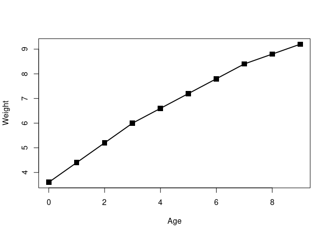
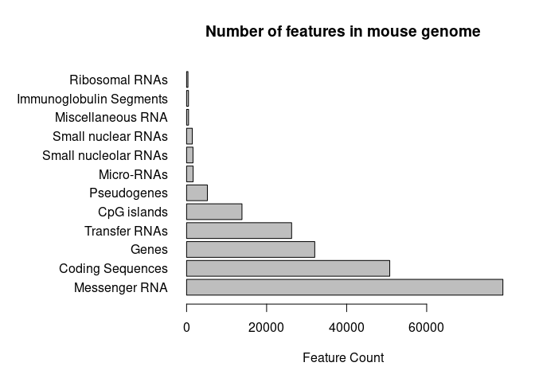
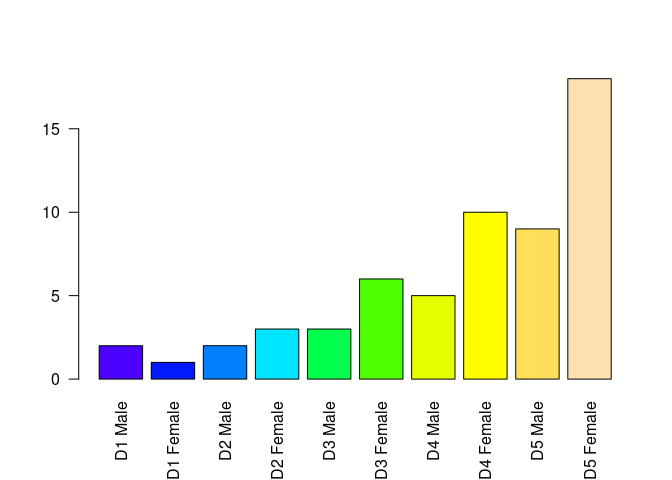
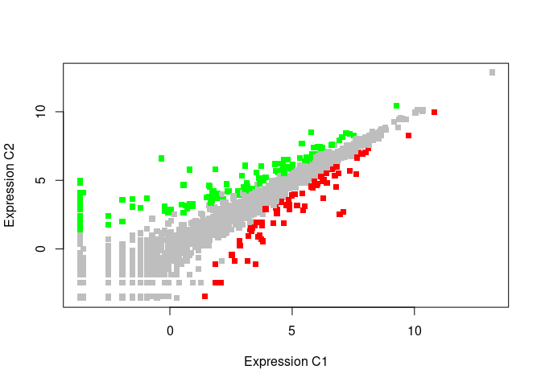

Class 05: R Graphics
================
Akshara Balachandra
6/5/2019

``` r
source('./class05.R', echo = T)
```

    ## 
    ## > weight.table <- read.table(file = "bimm143_05_rstats/weight_chart.txt", 
    ## +     header = TRUE, sep = "\t")
    ## 
    ## > plot(weight.table$Age, weight.table$Weight, xlab = "Age", 
    ## +     ylab = "Weight", pch = 15, cex = 1.5, lwd = 2, typ = "o")

<!-- -->

``` r
source('./class05_2.R', echo = T)
```

    ## 
    ## > features <- read.table(file = "bimm143_05_rstats/feature_counts.txt", 
    ## +     header = TRUE, sep = "\t")
    ## 
    ## > par(mar = c(5.1, 12, 4.1, 2.1))
    ## 
    ## > barplot(features$Count, horiz = TRUE, xlab = "Feature Count", 
    ## +     names.arg = features$Feature, las = 1, main = "Number of features in mouse geno ..." ... [TRUNCATED]

<!-- -->

``` r
source('./class05_3.R', echo = T)
```

    ## 
    ## > mf_cnts <- read.table(file = "bimm143_05_rstats/male_female_counts.txt", 
    ## +     header = TRUE, sep = "\t")
    ## 
    ## > barplot(mf_cnts$Count, names.arg = mf_cnts$Sample, 
    ## +     las = 2, col = topo.colors(10))

<!-- -->

    ## 
    ## > up_down <- read.table(file = "bimm143_05_rstats/up_down_expression.txt", 
    ## +     header = T, sep = "\t")
    ## 
    ## > table(up_down$State)
    ## 
    ##       down unchanging         up 
    ##         72       4997        127 
    ## 
    ## > palette(value = c("red", "gray", "green"))
    ## 
    ## > plot(up_down$Condition1, up_down$Condition2, xlab = "Expression C1", 
    ## +     ylab = "Expression C2", col = up_down$State, pch = 15)

<!-- -->
