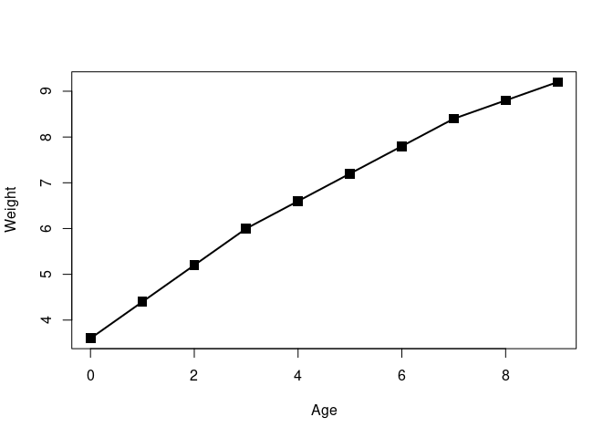
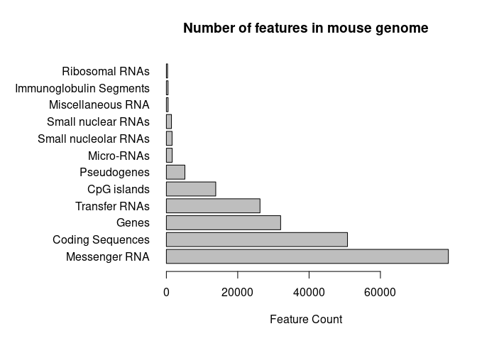
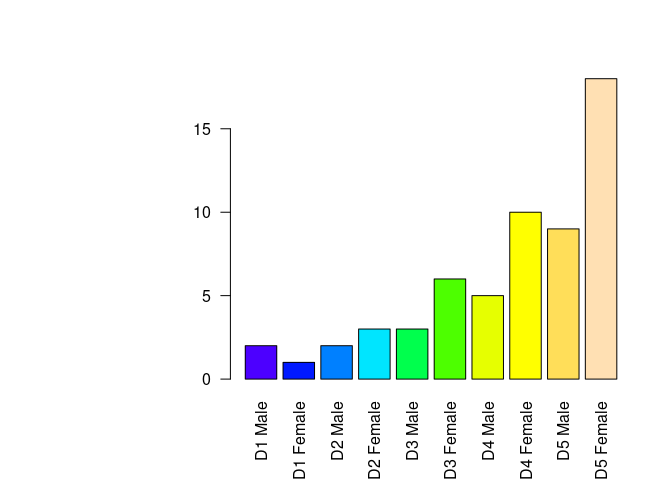
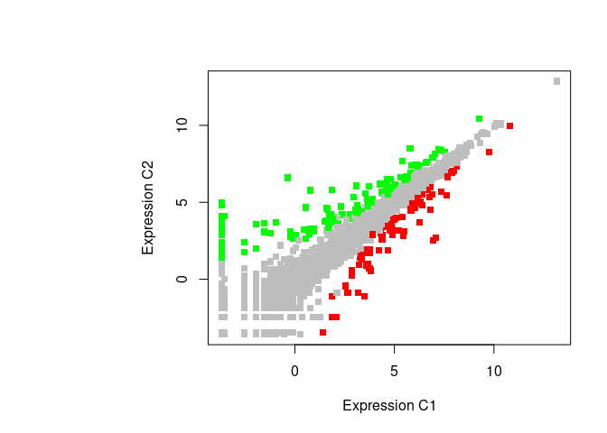

Class05: R Graphics
================
Akshara Balachandra
05/03/19

``` r
# master R file

source("class05.R")
```

<!-- -->

``` r
source("class05_2.R")
```

<!-- -->

``` r
source("class05_3.R")
```

<!-- --><!-- -->
