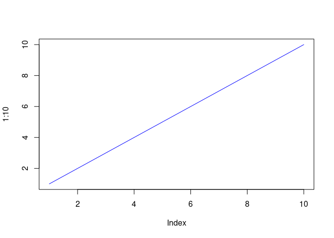
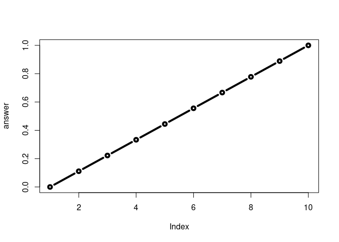
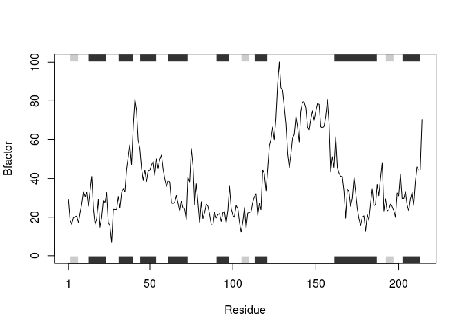
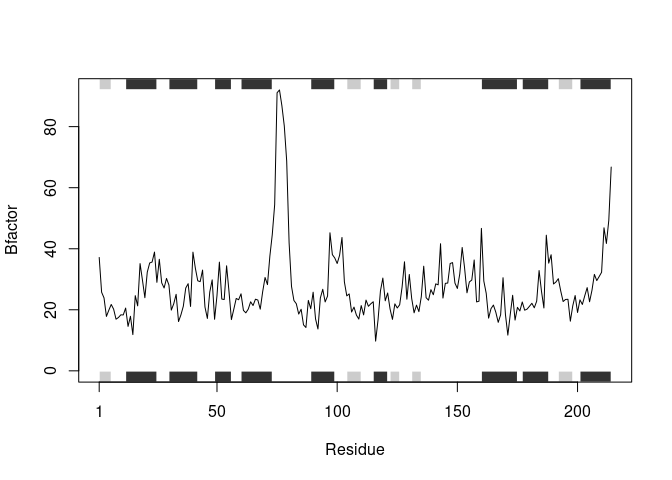
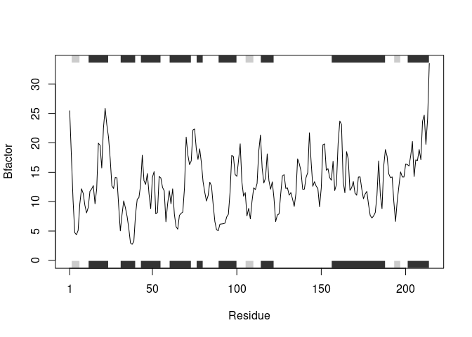

Class 6: R Functions
================
Akshara Balachandra
April 19, 2019

## Overview

Today we’ll be going over **R functions**, but will start off with some
**file reading first**.

``` r
plot(1:10, type = 'l', col = 'blue')
```

<!-- -->

# test1 file

``` r
test1 <- read.table('test1.txt', header = T, sep = ',')
test1
```

    ##   Col1 Col2 Col3
    ## 1    1    2    3
    ## 2    4    5    6
    ## 3    7    8    9
    ## 4    a    b    c

# test2 file

``` r
test2 <- read.table('./test2.txt', sep = '$', header = T)
test2
```

    ##   Col1 Col2 Col3
    ## 1    1    2    3
    ## 2    4    5    6
    ## 3    7    8    9
    ## 4    a    b    c

# test3 file

``` r
test3 <- read.table('./test3.txt', header = F)
test3
```

    ##   V1 V2 V3
    ## 1  1  6  a
    ## 2  2  7  b
    ## 3  3  8  c
    ## 4  4  9  d
    ## 5  5 10  e

## First function

``` r
add <- function(x, y = 1) {
  # the body
  x + y
}
```

``` r
add(c(1, 3, 5))
```

    ## [1] 2 4 6

``` r
# add(1, 3, 5)
# add(x = 1, y = "barry")
```

``` r
rescale <- function(x) {
  rng <- range(x)
  (x - rng[1]) / (rng[2] - rng[1])
}
```

``` r
rescale2 <- function(x, na.rm = T) {
  rng <- range(x, na.rm = na.rm)
  (x - rng[1]) / (rng[2] - rng[1])
}
```

``` r
x <- c(1:10, NA)
rng <- range(x)
(x - rng[1]) / (rng[2] - rng[1])
```

    ##  [1] NA NA NA NA NA NA NA NA NA NA NA

``` r
rng
```

    ## [1] NA NA

``` r
print(rescale2(c(1:10, NA)))
```

    ##  [1] 0.0000000 0.1111111 0.2222222 0.3333333 0.4444444 0.5555556 0.6666667
    ##  [8] 0.7777778 0.8888889 1.0000000        NA

``` r
print(rescale2(c(1:10, NA), na.rm = F))
```

    ##  [1] NA NA NA NA NA NA NA NA NA NA NA

Another example extension…

``` r
rescale3 <- function(x, na.rm=TRUE, plot=FALSE) {
  rng <-range(x, na.rm=na.rm)

  print("Hello")
  answer <- (x - rng[1]) / (rng[2] - rng[1])
  print("is it me you are looking for?")
  if(plot) {
    plot(answer, typ="b", lwd=4)
    print("Don't sing please!!!!")
  }
  print("I can see it in ...")
  return(answer)
}
```

``` r
rescale3(1:10)
```

    ## [1] "Hello"
    ## [1] "is it me you are looking for?"
    ## [1] "I can see it in ..."

    ##  [1] 0.0000000 0.1111111 0.2222222 0.3333333 0.4444444 0.5555556 0.6666667
    ##  [8] 0.7777778 0.8888889 1.0000000

``` r
rescale3(1:10, plot = T)
```

    ## [1] "Hello"
    ## [1] "is it me you are looking for?"

<!-- -->

    ## [1] "Don't sing please!!!!"
    ## [1] "I can see it in ..."

    ##  [1] 0.0000000 0.1111111 0.2222222 0.3333333 0.4444444 0.5555556 0.6666667
    ##  [8] 0.7777778 0.8888889 1.0000000

## Practical protein interaction example

``` r
source('./bio3d_example.R')
```

    ## Loading required package: bio3d

``` r
prot_interact('4AKE')
```

    ##   Note: Accessing on-line PDB file

<!-- -->

``` r
prot_interact('1AKE')
```

    ##   Note: Accessing on-line PDB file
    ##    PDB has ALT records, taking A only, rm.alt=TRUE

<!-- -->

``` r
prot_interact('1E4Y')
```

    ##   Note: Accessing on-line PDB file

<!-- -->
