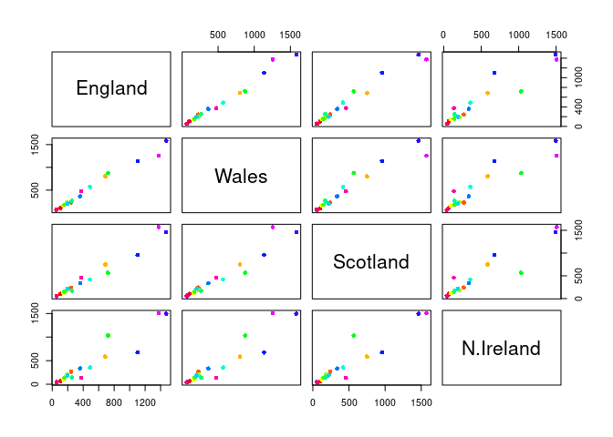
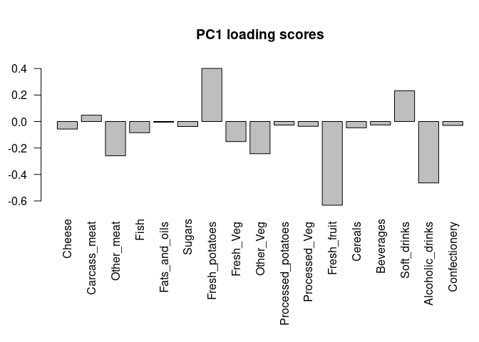

Class 08 Unsupervised Learning
================
Akshara Balachandra
04/26/19

## KNN clustering examples

``` r
tmp <- c(rnorm(30, -3), rnorm(30, 3))
x <- cbind(x = tmp, y = rev(tmp))
plot(x)
```

<!-- -->

``` r
# running kmeans
ans <- kmeans(x, 2, 5)
ans
```

    ## K-means clustering with 2 clusters of sizes 30, 30
    ## 
    ## Cluster means:
    ##           x         y
    ## 1  2.899422 -2.853048
    ## 2 -2.853048  2.899422
    ## 
    ## Clustering vector:
    ##  [1] 2 2 2 2 2 2 2 2 2 2 2 2 2 2 2 2 2 2 2 2 2 2 2 2 2 2 2 2 2 2 1 1 1 1 1
    ## [36] 1 1 1 1 1 1 1 1 1 1 1 1 1 1 1 1 1 1 1 1 1 1 1 1 1
    ## 
    ## Within cluster sum of squares by cluster:
    ## [1] 67.98023 67.98023
    ##  (between_SS / total_SS =  88.0 %)
    ## 
    ## Available components:
    ## 
    ## [1] "cluster"      "centers"      "totss"        "withinss"    
    ## [5] "tot.withinss" "betweenss"    "size"         "iter"        
    ## [9] "ifault"

``` r
print(paste("There are", ans$size[1], "points in cluster 1 and",
        ans$size[2], "points in cluster 2"))
```

    ## [1] "There are 30 points in cluster 1 and 30 points in cluster 2"

### Questions

1.  How many points are in each cluster?
      - 30 each
2.  What component of result object details
      - cluster size: `size`
      - cluster assigment/membership: `cluster`
      - cluster center: `centers`
3.  Plot colored kmeans clustered assigment

<!-- end list -->

``` r
plot(x, typ = 'p', col = ans$cluster)
points(ans$centers, col = 'blue', pch = 18, cex = 3)
```

<!-- -->

## Heirarchical clustering

No need to specify number of clusters beforehand….

``` r
d <- dist(x) # get distance matrix
hc <- hclust(d)
hc # not very useful to print object
```

    ## 
    ## Call:
    ## hclust(d = d)
    ## 
    ## Cluster method   : complete 
    ## Distance         : euclidean 
    ## Number of objects: 60

So, let’s plot instead…

``` r
plot(hc)
abline(h = 10, col = 'red')
```

<!-- -->

``` r
gp1 <- cutree(hc, k = 2) # cut to give two clusters
gp2 <- cutree(hc, h = 10) # cut at height 10
gp3 <- cutree(hc, k = 3) # cut to give three clusters

table(gp2, gp3)
```

    ##    gp3
    ## gp2  1  2  3
    ##   1 30  0  0
    ##   2  0 28  2

### Example HClustering

``` r
# Step 1. Generate some example data for clustering
x <- rbind(
        matrix(rnorm(100, mean=0, sd = 0.3), ncol = 2), # c1
        matrix(rnorm(100, mean = 1, sd = 0.3), ncol = 2), # c2
        matrix(c(rnorm(50, mean = 1, sd = 0.3), # c3
             rnorm(50, mean = 0, sd = 0.3)), ncol = 2))

colnames(x) <- c("x", "y")
# Step 2. Plot the data without clustering
plot(x)
```

<!-- -->

``` r
# Step 3. Generate colors for known clusters
# (just so we can compare to hclust results)
col <- as.factor( rep(c("c1","c2","c3"), each=50) )
plot(x, col=col)
```

<!-- -->

#### Questions

Use dist(), hclust(), plot, cutree functions to return 2 and 3 clusters

``` r
distance <- dist(x)
hc <- hclust(distance)
plot(hc)
```

<!-- -->

``` r
clust2 <- cutree(hc, k = 2)
clust3 <- cutree(hc, k = 3)

table(clust2, clust3)
```

    ##       clust3
    ## clust2  1  2  3
    ##      1 50  0 42
    ##      2  0 58  0

Plotting the three clusters found…

``` r
plot(x, col = clust3, main = 'HClustering clusters')
```

<!-- -->

``` r
plot(x, col = col, main = 'Original clusters')
```

<!-- -->

## PCA

PCA with `prcomp` from `{base}` R package.

``` r
mydata <- read.csv('https://tinyurl.com/expression-CSV', row.names = 1)
head(mydata)
```

    ##        wt1 wt2  wt3  wt4 wt5 ko1 ko2 ko3 ko4 ko5
    ## gene1  439 458  408  429 420  90  88  86  90  93
    ## gene2  219 200  204  210 187 427 423 434 433 426
    ## gene3 1006 989 1030 1017 973 252 237 238 226 210
    ## gene4  783 792  829  856 760 849 856 835 885 894
    ## gene5  181 249  204  244 225 277 305 272 270 279
    ## gene6  460 502  491  491 493 612 594 577 618 638

``` r
dim(mydata)
```

    ## [1] 100  10

There are 100 genes in the data, with 10 experimental conditions.

``` r
pca <- prcomp(t(mydata), scale = T)
summary(pca)
```

    ## Importance of components:
    ##                           PC1    PC2     PC3     PC4     PC5     PC6
    ## Standard deviation     9.6237 1.5198 1.05787 1.05203 0.88062 0.82545
    ## Proportion of Variance 0.9262 0.0231 0.01119 0.01107 0.00775 0.00681
    ## Cumulative Proportion  0.9262 0.9493 0.96045 0.97152 0.97928 0.98609
    ##                            PC7     PC8     PC9      PC10
    ## Standard deviation     0.80111 0.62065 0.60342 3.348e-15
    ## Proportion of Variance 0.00642 0.00385 0.00364 0.000e+00
    ## Cumulative Proportion  0.99251 0.99636 1.00000 1.000e+00

``` r
attributes(pca)
```

    ## $names
    ## [1] "sdev"     "rotation" "center"   "scale"    "x"       
    ## 
    ## $class
    ## [1] "prcomp"

Let’s make our first PCA plot.

``` r
## Precent variance is often more informative to look at
pca.var <- pca$sdev^2
pca.var.per <- round(pca.var/sum(pca.var)*100, 1)

pca.var.per
```

    ##  [1] 92.6  2.3  1.1  1.1  0.8  0.7  0.6  0.4  0.4  0.0

``` r
# make some colors yo
mycols <- c(rep('red', 5), rep('blue', 5))

xlab = paste('PC1 (', pca.var.per[1], '%)', sep = '')
ylab = paste('PC2 (', pca.var.per[2], '%)', sep = '')
plot(pca$x[,1], pca$x[,2], xlab = xlab, ylab = ylab, col = mycols)
text(pca$x[,1], pca$x[,2], colnames(mydata))
```

<!-- -->

## PCA on UK foods dataset

Read the data…

``` r
food.data <- read.csv('data/UK_foods.csv', row.names = 1)
head(food.data)
```

    ##                England Wales Scotland N.Ireland
    ## Cheese             105   103      103        66
    ## Carcass_meat       245   227      242       267
    ## Other_meat         685   803      750       586
    ## Fish               147   160      122        93
    ## Fats_and_oils      193   235      184       209
    ## Sugars             156   175      147       139

There are 17 rows and 4 columns in the dataset. You should read the data
in properly instead of setting manually the first column as row names.

Exploratory data analysis with
barplots\!

``` r
barplot(as.matrix(food.data), beside = T, col = rainbow(nrow(food.data)))
```

<!-- -->

``` r
# weirdo stacked plot...
barplot(as.matrix(food.data), col = rainbow(nrow(food.data)))
```

<!-- -->

You need `beside = T` to get horizontally “stacked” bars. We can also
generate pairwise plots between every pair of countries and visualize.

``` r
pairs(food.data, col = rainbow(nrow(food.data)), pch = 16)
```

<!-- -->

Northern Ireland has blue and orange points that are way off the
diagonal unlike the other countries.

PCA:

``` r
pca <- prcomp(t(food.data))
summary(pca)
```

    ## Importance of components:
    ##                             PC1      PC2      PC3       PC4
    ## Standard deviation     324.1502 212.7478 73.87622 4.189e-14
    ## Proportion of Variance   0.6744   0.2905  0.03503 0.000e+00
    ## Cumulative Proportion    0.6744   0.9650  1.00000 1.000e+00

``` r
plot(pca$x[,1], pca$x[,2], xlab="PC1", ylab="PC2", xlim=c(-270,500))
#            ENGLAND    WALES   SCOT    NI
colors <- c('orange',   'red',  'blue', 'green')
text(pca$x[,1], pca$x[,2], colnames(food.data), col = colors)
```

<!-- -->

Calculating/plotting percent variation captured by each PC…

``` r
sdev <- pca$sdev
v <- round(sdev ^ 2 / sum(sdev^2) * 100)

barplot(v, xlab = 'Principal component', ylab = 'Percent variation')
```

<!-- -->

### PC Weights

Calculating loading scores….

``` r
## Lets focus on PC1 as it accounts for > 90% of variance
par(mar=c(10, 3, 5, 0))
barplot( pca$rotation[,1], las=2, main = 'PC1 loading scores')
```

<!-- -->

``` r
par(mar=c(10, 3, 5, 0))
barplot( pca$rotation[,2], las=2, main = 'PC2 loading scores')
```

<!-- -->

PC2 tells mainly about potatoes and soft drinks (largest weights by
absolute value)

Biplotting…

``` r
biplot(pca)
```

<!-- -->
