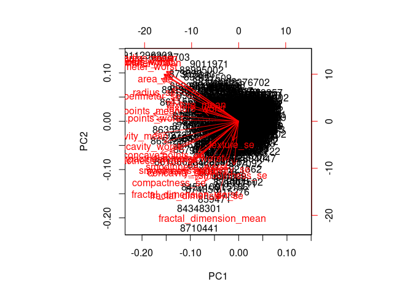
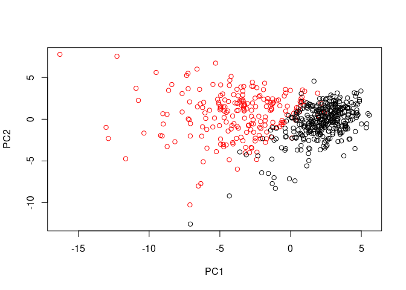
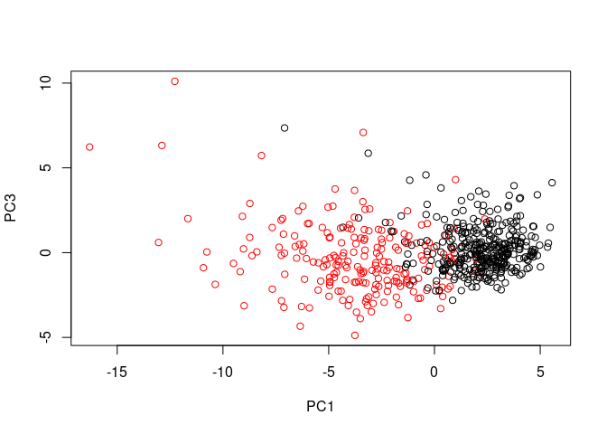
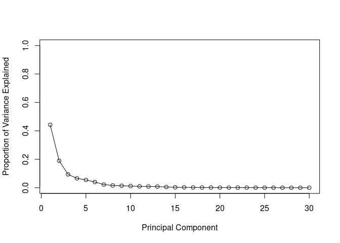
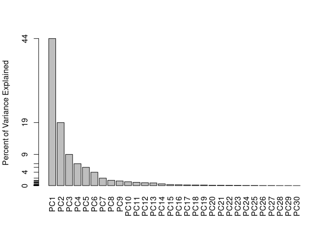
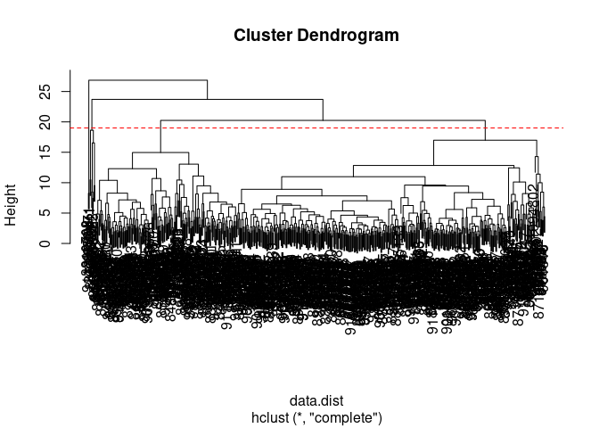
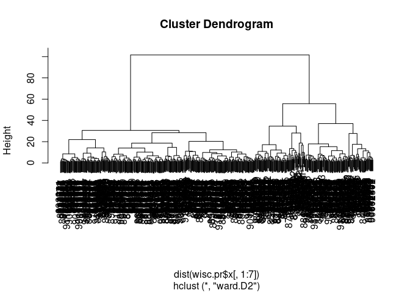
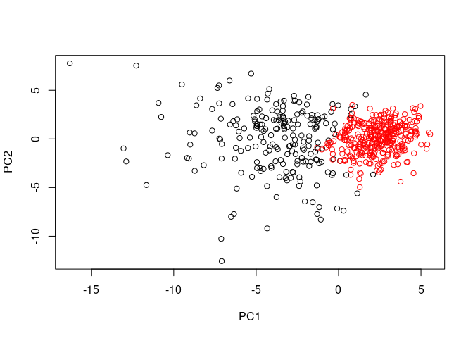
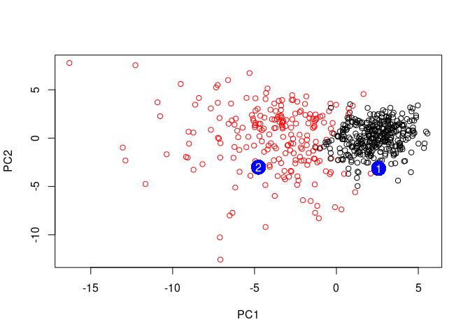

Class 09 Unsupervised Learning
================
Akshara Balachandra
05/01/19

## Unsupervised learning analysis of breast cancer cells

``` r
wisc.df <- read.csv('data/WisconsinCancer.csv', header = T)
nrow(wisc.df)
```

    ## [1] 569

``` r
ncol(wisc.df)
```

    ## [1] 33

``` r
table(wisc.df$diagnosis)
```

    ## 
    ##   B   M 
    ## 357 212

Number of features containing "\_mean"

``` r
sum(grepl("_mean", colnames(wisc.df)))
```

    ## [1] 10

``` r
length(grep("_mean", colnames(wisc.df)))
```

    ## [1] 10

Converting dataframe to matrix taking only columns 3 to 32…

``` r
final.col <- ncol(wisc.df) - 1
wisc.data <- as.matrix(wisc.df[,3:final.col])
row.names(wisc.data) <- wisc.df$id

diagnosis <- wisc.df$diagnosis

#head(wisc.data)
```

## PCA

Check column means and standard deviation of
    features.

``` r
colMeans(wisc.data)
```

    ##             radius_mean            texture_mean          perimeter_mean 
    ##            1.412729e+01            1.928965e+01            9.196903e+01 
    ##               area_mean         smoothness_mean        compactness_mean 
    ##            6.548891e+02            9.636028e-02            1.043410e-01 
    ##          concavity_mean     concave.points_mean           symmetry_mean 
    ##            8.879932e-02            4.891915e-02            1.811619e-01 
    ##  fractal_dimension_mean               radius_se              texture_se 
    ##            6.279761e-02            4.051721e-01            1.216853e+00 
    ##            perimeter_se                 area_se           smoothness_se 
    ##            2.866059e+00            4.033708e+01            7.040979e-03 
    ##          compactness_se            concavity_se       concave.points_se 
    ##            2.547814e-02            3.189372e-02            1.179614e-02 
    ##             symmetry_se    fractal_dimension_se            radius_worst 
    ##            2.054230e-02            3.794904e-03            1.626919e+01 
    ##           texture_worst         perimeter_worst              area_worst 
    ##            2.567722e+01            1.072612e+02            8.805831e+02 
    ##        smoothness_worst       compactness_worst         concavity_worst 
    ##            1.323686e-01            2.542650e-01            2.721885e-01 
    ##    concave.points_worst          symmetry_worst fractal_dimension_worst 
    ##            1.146062e-01            2.900756e-01            8.394582e-02

``` r
apply(wisc.data, 2, sd)
```

    ##             radius_mean            texture_mean          perimeter_mean 
    ##            3.524049e+00            4.301036e+00            2.429898e+01 
    ##               area_mean         smoothness_mean        compactness_mean 
    ##            3.519141e+02            1.406413e-02            5.281276e-02 
    ##          concavity_mean     concave.points_mean           symmetry_mean 
    ##            7.971981e-02            3.880284e-02            2.741428e-02 
    ##  fractal_dimension_mean               radius_se              texture_se 
    ##            7.060363e-03            2.773127e-01            5.516484e-01 
    ##            perimeter_se                 area_se           smoothness_se 
    ##            2.021855e+00            4.549101e+01            3.002518e-03 
    ##          compactness_se            concavity_se       concave.points_se 
    ##            1.790818e-02            3.018606e-02            6.170285e-03 
    ##             symmetry_se    fractal_dimension_se            radius_worst 
    ##            8.266372e-03            2.646071e-03            4.833242e+00 
    ##           texture_worst         perimeter_worst              area_worst 
    ##            6.146258e+00            3.360254e+01            5.693570e+02 
    ##        smoothness_worst       compactness_worst         concavity_worst 
    ##            2.283243e-02            1.573365e-01            2.086243e-01 
    ##    concave.points_worst          symmetry_worst fractal_dimension_worst 
    ##            6.573234e-02            6.186747e-02            1.806127e-02

Column means are very different between different features, so I need to
scale the data before pca.

``` r
wisc.pr <- prcomp(wisc.data, scale = T)

# summary of results
summary(wisc.pr)
```

    ## Importance of components:
    ##                           PC1    PC2     PC3     PC4     PC5     PC6
    ## Standard deviation     3.6444 2.3857 1.67867 1.40735 1.28403 1.09880
    ## Proportion of Variance 0.4427 0.1897 0.09393 0.06602 0.05496 0.04025
    ## Cumulative Proportion  0.4427 0.6324 0.72636 0.79239 0.84734 0.88759
    ##                            PC7     PC8    PC9    PC10   PC11    PC12
    ## Standard deviation     0.82172 0.69037 0.6457 0.59219 0.5421 0.51104
    ## Proportion of Variance 0.02251 0.01589 0.0139 0.01169 0.0098 0.00871
    ## Cumulative Proportion  0.91010 0.92598 0.9399 0.95157 0.9614 0.97007
    ##                           PC13    PC14    PC15    PC16    PC17    PC18
    ## Standard deviation     0.49128 0.39624 0.30681 0.28260 0.24372 0.22939
    ## Proportion of Variance 0.00805 0.00523 0.00314 0.00266 0.00198 0.00175
    ## Cumulative Proportion  0.97812 0.98335 0.98649 0.98915 0.99113 0.99288
    ##                           PC19    PC20   PC21    PC22    PC23   PC24
    ## Standard deviation     0.22244 0.17652 0.1731 0.16565 0.15602 0.1344
    ## Proportion of Variance 0.00165 0.00104 0.0010 0.00091 0.00081 0.0006
    ## Cumulative Proportion  0.99453 0.99557 0.9966 0.99749 0.99830 0.9989
    ##                           PC25    PC26    PC27    PC28    PC29    PC30
    ## Standard deviation     0.12442 0.09043 0.08307 0.03987 0.02736 0.01153
    ## Proportion of Variance 0.00052 0.00027 0.00023 0.00005 0.00002 0.00000
    ## Cumulative Proportion  0.99942 0.99969 0.99992 0.99997 1.00000 1.00000

Q4: 44% of original variance from PC-1 Q5: 3 PCs (72.6% variance) Q6: 7
PCs (91.0% variance)

### Interpreting PCA results

``` r
biplot(wisc.pr)
```

<!-- -->

This plot is pretty much useless, we can’t see anything. So, let’s
create a scatter plot of the first two PCs.

``` r
plot(x = wisc.pr$x[,1], y = wisc.pr$x[,2], col = diagnosis,
     xlab = "PC1", ylab = "PC2")
```

<!-- -->

``` r
plot(x = wisc.pr$x[,1], y = wisc.pr$x[,3], col = diagnosis,
     xlab = "PC1", ylab = "PC3")
```

<!-- -->

PC1 vs PC2 gives a more clear-cut boundary between the two groups than
PC1 vs PC3 because PC2 explains more variance in the data than PC3.

### Variance explained

``` r
pc.var <- wisc.pr$sdev ^ 2

# variance explained by each pc: pve
total_var <- sum(pc.var)

pve <- pc.var / total_var

plot(pve, xlab = "Principal Component",
     ylab = 'Proportion of Variance Explained',
     ylim = c(0, 1), type = 'o')
```

<!-- -->

``` r
# barplot version
barplot(pve, ylab = "Percent of Variance Explained",
    names.arg=paste0("PC", 1:length(pve)), las=2, axes = FALSE)

axis(2, at=pve, labels=round(pve,2 )*100)
```

<!-- -->

### Communicating PCA results

Loading values for
    PCs

``` r
sort(abs(wisc.pr$rotation[, 1]))
```

    ##           smoothness_se              texture_se             symmetry_se 
    ##              0.01453145              0.01742803              0.04249842 
    ##  fractal_dimension_mean    fractal_dimension_se            texture_mean 
    ##              0.06436335              0.10256832              0.10372458 
    ##           texture_worst          symmetry_worst        smoothness_worst 
    ##              0.10446933              0.12290456              0.12795256 
    ## fractal_dimension_worst           symmetry_mean         smoothness_mean 
    ##              0.13178394              0.13816696              0.14258969 
    ##            concavity_se          compactness_se       concave.points_se 
    ##              0.15358979              0.17039345              0.18341740 
    ##                 area_se               radius_se       compactness_worst 
    ##              0.20286964              0.20597878              0.21009588 
    ##            perimeter_se             radius_mean               area_mean 
    ##              0.21132592              0.21890244              0.22099499 
    ##              area_worst          perimeter_mean            radius_worst 
    ##              0.22487053              0.22753729              0.22799663 
    ##         concavity_worst         perimeter_worst        compactness_mean 
    ##              0.22876753              0.23663968              0.23928535 
    ##    concave.points_worst          concavity_mean     concave.points_mean 
    ##              0.25088597              0.25840048              0.26085376

## Heirarchical Clustering

Scale and find distances of data…

``` r
data.scaled <- scale(wisc.data)
data.dist <- dist(data.scaled)
```

Create hclust model…

``` r
wisc.hclust <- hclust(data.dist, method = 'complete')
plot(wisc.hclust)
abline(h = 19, col = 'red', lty = 2)
```

<!-- -->

### Selecting number of clusters

``` r
wisc.hclust.clusters <- cutree(wisc.hclust, k = 4)
table(wisc.hclust.clusters, diagnosis)
```

    ##                     diagnosis
    ## wisc.hclust.clusters   B   M
    ##                    1  12 165
    ##                    2   2   5
    ##                    3 343  40
    ##                    4   0   2

4 clusters gives best separation.

## Combining methods (pca + hclust)

Do hclust on pca data

``` r
wisc.pr.hclust <- hclust( dist( wisc.pr$x[, 1:7] ), method = 'ward.D2')
plot(wisc.pr.hclust)
```

<!-- -->

``` r
grps <- cutree(wisc.pr.hclust, k = 2)
table(grps, diagnosis)
```

    ##     diagnosis
    ## grps   B   M
    ##    1  28 188
    ##    2 329  24

``` r
plot(wisc.pr$x[, 1:2], col = grps)
```

<!-- -->

``` r
plot(wisc.pr$x[, 1:2], col = diagnosis)
```

<!-- -->

Recolor the hclust groupings PC plot…

``` r
g <- as.factor(grps)
levels(g)
```

    ## [1] "1" "2"

``` r
g <- relevel(g, 2)
levels(g)
```

    ## [1] "2" "1"

``` r
# plot with reordered levels
plot(wisc.pr$x[, 1:2], col = g)
```

<!-- -->

## Precition

Project new data onto PCA basis vectors

``` r
url <- 'https://tinyurl.com/new-samples-CSV'
new <- read.csv(url)
npc <- predict(wisc.pr, newdata = new)
head(npc)
```

    ##            PC1       PC2        PC3        PC4       PC5        PC6
    ## [1,]  2.576616 -3.135913  1.3990492 -0.7631950  2.781648 -0.8150185
    ## [2,] -4.754928 -3.009033 -0.1660946 -0.6052952 -1.140698 -1.2189945
    ##             PC7        PC8       PC9       PC10      PC11      PC12
    ## [1,] -0.3959098 -0.2307350 0.1029569 -0.9272861 0.3411457  0.375921
    ## [2,]  0.8193031 -0.3307423 0.5281896 -0.4855301 0.7173233 -1.185917
    ##           PC13     PC14      PC15       PC16        PC17        PC18
    ## [1,] 0.1610764 1.187882 0.3216974 -0.1743616 -0.07875393 -0.11207028
    ## [2,] 0.5893856 0.303029 0.1299153  0.1448061 -0.40509706  0.06565549
    ##             PC19       PC20       PC21       PC22       PC23       PC24
    ## [1,] -0.08802955 -0.2495216  0.1228233 0.09358453 0.08347651  0.1223396
    ## [2,]  0.25591230 -0.4289500 -0.1224776 0.01732146 0.06316631 -0.2338618
    ##             PC25         PC26         PC27        PC28         PC29
    ## [1,]  0.02124121  0.078884581  0.220199544 -0.02946023 -0.015620933
    ## [2,] -0.20755948 -0.009833238 -0.001134152  0.09638361  0.002795349
    ##              PC30
    ## [1,]  0.005269029
    ## [2,] -0.019015820

``` r
# plot these patients with existing data...
plot(wisc.pr$x[, 1:2], col = g)
points(npc[, 1], npc[, 2], col = 'blue', pch = 16, cex=3)
text(npc[, 1], npc[, 2], col = 'white')
```

<!-- -->

Patient 2 should be followed up on because they have features that align
them closely wiht other cancer patients.

## Optional (PCA on protein data)
