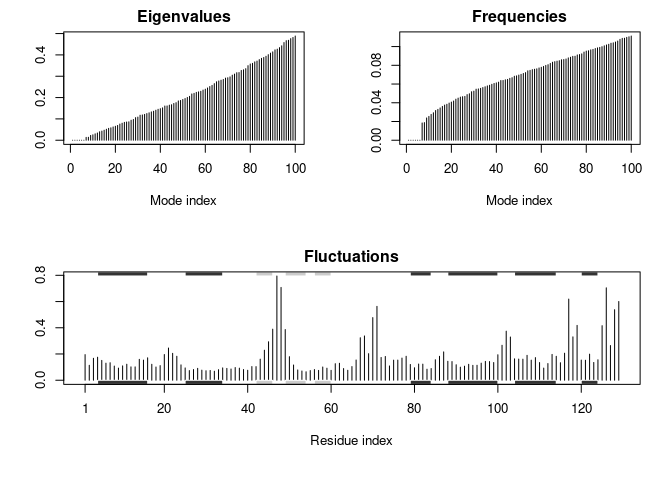

Class 12
================

## Obtain and prepare our structure for docking

Downloading HIV-pr structure from PDB….

``` r
require(bio3d)
```

    ## Loading required package: bio3d

``` r
prot.id <- '1hsg'

file <- get.pdb(prot.id)
```

    ## Warning in get.pdb(prot.id): ./1hsg.pdb exists. Skipping download

``` r
pdb <- read.pdb(file)
pdb
```

    ## 
    ##  Call:  read.pdb(file = file)
    ## 
    ##    Total Models#: 1
    ##      Total Atoms#: 1686,  XYZs#: 5058  Chains#: 2  (values: A B)
    ## 
    ##      Protein Atoms#: 1514  (residues/Calpha atoms#: 198)
    ##      Nucleic acid Atoms#: 0  (residues/phosphate atoms#: 0)
    ## 
    ##      Non-protein/nucleic Atoms#: 172  (residues: 128)
    ##      Non-protein/nucleic resid values: [ HOH (127), MK1 (1) ]
    ## 
    ##    Protein sequence:
    ##       PQITLWQRPLVTIKIGGQLKEALLDTGADDTVLEEMSLPGRWKPKMIGGIGGFIKVRQYD
    ##       QILIEICGHKAIGTVLVGPTPVNIIGRNLLTQIGCTLNFPQITLWQRPLVTIKIGGQLKE
    ##       ALLDTGADDTVLEEMSLPGRWKPKMIGGIGGFIKVRQYDQILIEICGHKAIGTVLVGPTP
    ##       VNIIGRNLLTQIGCTLNF
    ## 
    ## + attr: atom, xyz, seqres, helix, sheet,
    ##         calpha, remark, call

Extract the protein and ligands separately…

``` r
pdb.prot <- trim.pdb(pdb, 'protein')
pdb.lig <- trim.pdb(pdb, 'ligand')

pdb.prot
```

    ## 
    ##  Call:  trim.pdb(pdb = pdb, "protein")
    ## 
    ##    Total Models#: 1
    ##      Total Atoms#: 1514,  XYZs#: 4542  Chains#: 2  (values: A B)
    ## 
    ##      Protein Atoms#: 1514  (residues/Calpha atoms#: 198)
    ##      Nucleic acid Atoms#: 0  (residues/phosphate atoms#: 0)
    ## 
    ##      Non-protein/nucleic Atoms#: 0  (residues: 0)
    ##      Non-protein/nucleic resid values: [ none ]
    ## 
    ##    Protein sequence:
    ##       PQITLWQRPLVTIKIGGQLKEALLDTGADDTVLEEMSLPGRWKPKMIGGIGGFIKVRQYD
    ##       QILIEICGHKAIGTVLVGPTPVNIIGRNLLTQIGCTLNFPQITLWQRPLVTIKIGGQLKE
    ##       ALLDTGADDTVLEEMSLPGRWKPKMIGGIGGFIKVRQYDQILIEICGHKAIGTVLVGPTP
    ##       VNIIGRNLLTQIGCTLNF
    ## 
    ## + attr: atom, helix, sheet, seqres, xyz,
    ##         calpha, call

``` r
pdb.lig
```

    ## 
    ##  Call:  trim.pdb(pdb = pdb, "ligand")
    ## 
    ##    Total Models#: 1
    ##      Total Atoms#: 45,  XYZs#: 135  Chains#: 1  (values: B)
    ## 
    ##      Protein Atoms#: 0  (residues/Calpha atoms#: 0)
    ##      Nucleic acid Atoms#: 0  (residues/phosphate atoms#: 0)
    ## 
    ##      Non-protein/nucleic Atoms#: 45  (residues: 1)
    ##      Non-protein/nucleic resid values: [ MK1 (1) ]
    ## 
    ## + attr: atom, helix, sheet, seqres, xyz,
    ##         calpha, call

``` r
# write the pdb files to disk
write.pdb(pdb.prot, '1hsg_protein.pdb')
write.pdb(pdb.lig, '1hsg_ligand.pdb')
```

## Add hydrogens and charges in ADT

We loaded the protein into autodock tools added, hydrogens, and
extracted charges on each atom.

## Run docking

Run docking with Autodock vina…

`vina --cpu 3 --config config.txt --log vina.log`

## Inspect docking results

We will process the docking results in R

``` r
dock.res <- read.pdb('1hsg_ligand_out.pdbqt', multi = TRUE)
write.pdb(dock.res, 'results.pdb')
```

Docking looks okay, the ligand and new molecule overlap in the protein
pocket.

## Quantify the docking results

``` r
orig <- read.pdb('1hsg_ligand.pdbqt')
rmsd(orig, dock.res)
```

    ##  [1] 10.902  6.198  4.373 11.876  9.829  9.564 10.220 12.554  9.797  9.620
    ## [11]  9.636 11.050  9.578  9.380 11.140 10.774

## Normal Mode Analysis (NMA)

We’ll do NMA now…

``` r
pdb <- read.pdb('1hel')
```

    ##   Note: Accessing on-line PDB file

``` r
modes <- nma(pdb)
```

    ##  Building Hessian...     Done in 0.021 seconds.
    ##  Diagonalizing Hessian...    Done in 0.11 seconds.

``` r
plot(modes, sse = pdb)
```

<!-- -->

``` r
mktrj(modes, mode = 7, file = 'nma_7.pdb')
```
