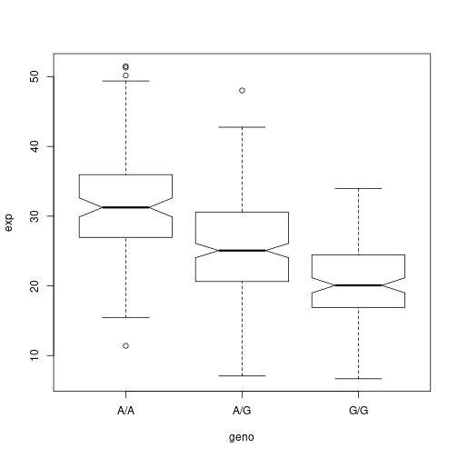
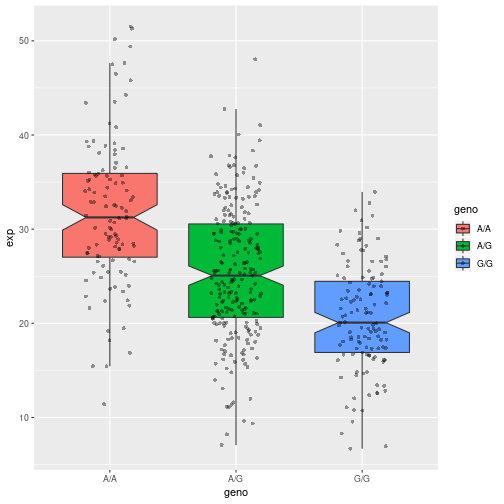

## MXL Genotype analysis


Read in the data....

```r
dat <- read.csv('data/rs8067378_variation.csv', header = TRUE)
head(dat)
```

```
##   Sample..Male.Female.Unknown. Genotype..forward.strand. Population.s.
## 1                  NA19648 (F)                       A|A ALL, AMR, MXL
## 2                  NA19649 (M)                       G|G ALL, AMR, MXL
## 3                  NA19651 (F)                       A|A ALL, AMR, MXL
## 4                  NA19652 (M)                       G|G ALL, AMR, MXL
## 5                  NA19654 (F)                       G|G ALL, AMR, MXL
## 6                  NA19655 (M)                       A|G ALL, AMR, MXL
##   Father Mother
## 1      -      -
## 2      -      -
## 3      -      -
## 4      -      -
## 5      -      -
## 6      -      -
```


```r
gen.bad <- 'G|G'

num.asthma.homoz <- sum(dat$Genotype..forward.strand. == gen.bad)

#### OR

table(dat$Genotype..forward.strand.)
```

```
## 
## A|A A|G G|A G|G 
##  22  21  12   9
```

Q5: What proportion of the Mexican Ancestry in Los Angeles sample population (MXL)
are homozygous for the asthma associated SNP (G|G)?

14.1% of MXL population is homozygous for the asthma associated SNP.


## Initial RNA-seq analysis

### Quality score analysis


```r
library(seqinr)
library(gtools)
phread <- asc(s2c('DDDDCDEDCDDDBBDDDCC@')) - 33
phread
```

```
##  D  D  D  D  C  D  E  D  C  D  D  D  B  B  D  D  D  C  C  @ 
## 35 35 35 35 34 35 36 35 34 35 35 35 33 33 35 35 35 34 34 31
```


### Expression analysis


```r
data <- read.csv('data/rs8067378_ENSG00000172057.6.txt', sep = ' ', header = TRUE)
head(data)
```

```
##    sample geno      exp
## 1 HG00367  A/G 28.96038
## 2 NA20768  A/G 20.24449
## 3 HG00361  A/A 31.32628
## 4 HG00135  A/A 34.11169
## 5 NA18870  G/G 18.25141
## 6 NA11993  A/A 32.89721
```


```r
print(summary(data))
```

```
##      sample     geno          exp        
##  HG00096:  1   A/A:108   Min.   : 6.675  
##  HG00097:  1   A/G:233   1st Qu.:20.004  
##  HG00099:  1   G/G:121   Median :25.116  
##  HG00100:  1             Mean   :25.640  
##  HG00101:  1             3rd Qu.:30.779  
##  HG00102:  1             Max.   :51.518  
##  (Other):456
```

```r
print(table(data$geno))
```

```
## 
## A/A A/G G/G 
## 108 233 121
```

```r
#library(dplyr)

summary(data[data$geno == 'G/G',]$exp)
```

```
##    Min. 1st Qu.  Median    Mean 3rd Qu.    Max. 
##   6.675  16.903  20.074  20.594  24.457  33.956
```

```r
summary(data[data$geno == 'A/G',]$exp)
```

```
##    Min. 1st Qu.  Median    Mean 3rd Qu.    Max. 
##   7.075  20.626  25.065  25.397  30.552  48.034
```

```r
summary(data[data$geno == 'A/A',]$exp)
```

```
##    Min. 1st Qu.  Median    Mean 3rd Qu.    Max. 
##   11.40   27.02   31.25   31.82   35.92   51.52
```

```r
boxplot(exp ~ geno, data, notch = T)
```



`ggplot` plots because they're prettier...


```r
library(ggplot2)
```

```
## Registered S3 methods overwritten by 'ggplot2':
##   method         from 
##   [.quosures     rlang
##   c.quosures     rlang
##   print.quosures rlang
```

```r
# Boxplot with the data shown
ggplot(data, aes(geno, exp, fill=geno)) +
	geom_boxplot(notch=TRUE, outlier.shape = NA) +
	geom_jitter(shape=16, position=position_jitter(0.2), alpha=0.4)
```




