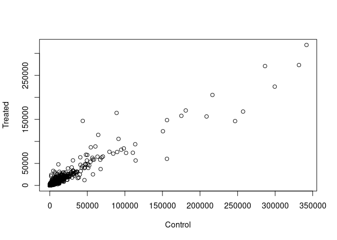
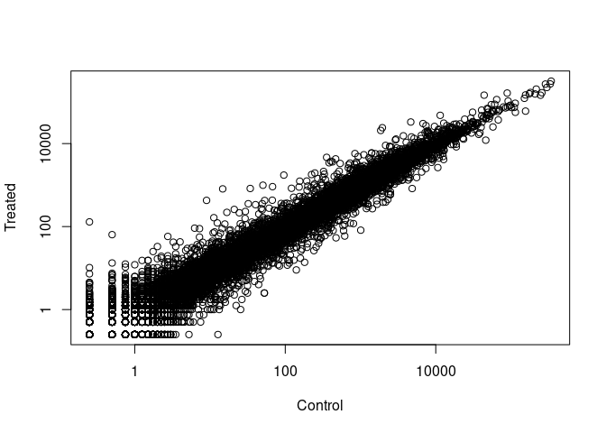
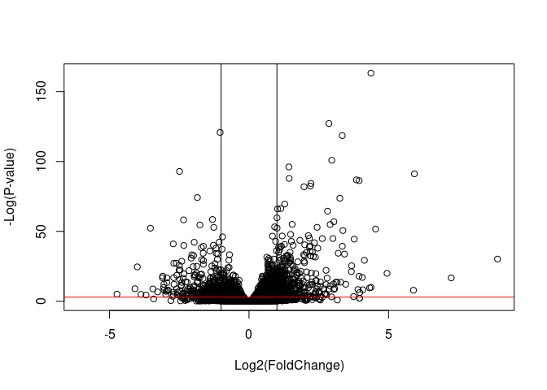
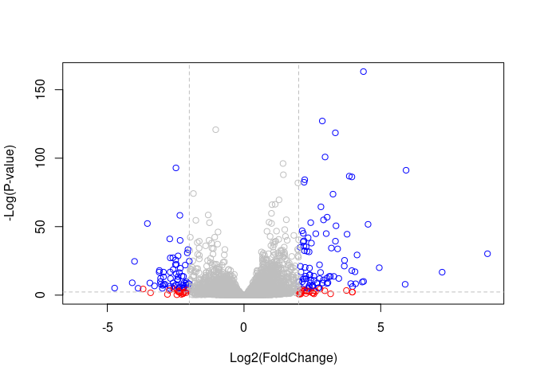
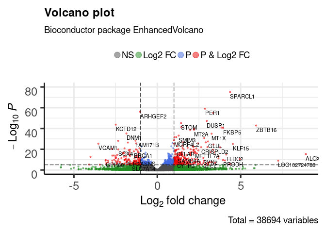

Class 14: RNAseq analysis
================
Akshara Balachandra
5/17/2019

Library imports…

``` r
library(DESeq2)
```

    ## Loading required package: S4Vectors

    ## Loading required package: stats4

    ## Loading required package: BiocGenerics

    ## Loading required package: parallel

    ## 
    ## Attaching package: 'BiocGenerics'

    ## The following objects are masked from 'package:parallel':
    ## 
    ##     clusterApply, clusterApplyLB, clusterCall, clusterEvalQ,
    ##     clusterExport, clusterMap, parApply, parCapply, parLapply,
    ##     parLapplyLB, parRapply, parSapply, parSapplyLB

    ## The following objects are masked from 'package:stats':
    ## 
    ##     IQR, mad, sd, var, xtabs

    ## The following objects are masked from 'package:base':
    ## 
    ##     anyDuplicated, append, as.data.frame, basename, cbind,
    ##     colnames, dirname, do.call, duplicated, eval, evalq, Filter,
    ##     Find, get, grep, grepl, intersect, is.unsorted, lapply, Map,
    ##     mapply, match, mget, order, paste, pmax, pmax.int, pmin,
    ##     pmin.int, Position, rank, rbind, Reduce, rownames, sapply,
    ##     setdiff, sort, table, tapply, union, unique, unsplit, which,
    ##     which.max, which.min

    ## 
    ## Attaching package: 'S4Vectors'

    ## The following object is masked from 'package:base':
    ## 
    ##     expand.grid

    ## Loading required package: IRanges

    ## Loading required package: GenomicRanges

    ## Loading required package: GenomeInfoDb

    ## Loading required package: SummarizedExperiment

    ## Loading required package: Biobase

    ## Welcome to Bioconductor
    ## 
    ##     Vignettes contain introductory material; view with
    ##     'browseVignettes()'. To cite Bioconductor, see
    ##     'citation("Biobase")', and for packages 'citation("pkgname")'.

    ## Loading required package: DelayedArray

    ## Loading required package: matrixStats

    ## 
    ## Attaching package: 'matrixStats'

    ## The following objects are masked from 'package:Biobase':
    ## 
    ##     anyMissing, rowMedians

    ## Loading required package: BiocParallel

    ## 
    ## Attaching package: 'DelayedArray'

    ## The following objects are masked from 'package:matrixStats':
    ## 
    ##     colMaxs, colMins, colRanges, rowMaxs, rowMins, rowRanges

    ## The following objects are masked from 'package:base':
    ## 
    ##     aperm, apply, rowsum

    ## Registered S3 methods overwritten by 'ggplot2':
    ##   method         from 
    ##   [.quosures     rlang
    ##   c.quosures     rlang
    ##   print.quosures rlang

``` r
library(tibble)
library(dplyr)
```

    ## 
    ## Attaching package: 'dplyr'

    ## The following object is masked from 'package:matrixStats':
    ## 
    ##     count

    ## The following object is masked from 'package:Biobase':
    ## 
    ##     combine

    ## The following objects are masked from 'package:GenomicRanges':
    ## 
    ##     intersect, setdiff, union

    ## The following object is masked from 'package:GenomeInfoDb':
    ## 
    ##     intersect

    ## The following objects are masked from 'package:IRanges':
    ## 
    ##     collapse, desc, intersect, setdiff, slice, union

    ## The following objects are masked from 'package:S4Vectors':
    ## 
    ##     first, intersect, rename, setdiff, setequal, union

    ## The following objects are masked from 'package:BiocGenerics':
    ## 
    ##     combine, intersect, setdiff, union

    ## The following objects are masked from 'package:stats':
    ## 
    ##     filter, lag

    ## The following objects are masked from 'package:base':
    ## 
    ##     intersect, setdiff, setequal, union

Read count data and metadata…

``` r
counts <- read.csv('data/airway_scaledcounts.csv', stringsAsFactors = F, row.names = 1)
metadata <- read.csv('data/airway_metadata.csv', stringsAsFactors = F)

#counts
#metadata

nrow(counts)
```

    ## [1] 38694

``` r
sum(metadata$dex == 'control')
```

    ## [1] 4

Q1: There are 38694 genes in the dataset. Q2: There are 4 control cell
lines

## Toy differential gene expression

``` r
control.cells <- metadata$id[metadata$dex == 'control']
treated.cells <- metadata$id[metadata$dex == 'treated']

control.sub <- subset(counts, select = control.cells)
treated.sub <- subset(counts, select = treated.cells)

control.means <- apply(control.sub, 1, mean)
treated.means <- apply(treated.sub, 1, mean)
```

``` r
control.mean <- sum(control.means)
treated.mean <- sum(treated.means)

mean.counts <- data.frame(control.means, treated.means)

print(paste('Control mean', round(control.mean)))
```

    ## [1] "Control mean 23005324"

``` r
print(paste('Treated mean', round(treated.mean)))
```

    ## [1] "Treated mean 22196524"

Scatter plot of means of controls vs treated…

``` r
plot(control.means, treated.means, xlab = 'Control',
     ylab = 'Treated')
```

<!-- -->

Plot with log scale…

``` r
plot(control.means, treated.means, xlab = 'Control',
     ylab = 'Treated', log = 'xy')
```

    ## Warning in xy.coords(x, y, xlabel, ylabel, log): 15032 x values <= 0
    ## omitted from logarithmic plot

    ## Warning in xy.coords(x, y, xlabel, ylabel, log): 15281 y values <= 0
    ## omitted from logarithmic plot

<!-- -->

Let’s combine the control and treated means and calculate log2 fold
change…

``` r
mean.counts <- data.frame(control.means, treated.means, 
                          row.names = row.names(counts))

mean.counts$log2foldchange <- log((mean.counts$treated.means/mean.counts$control.means),
                                  base = 2)

head(mean.counts)
```

    ##                 control.means treated.means log2foldchange
    ## ENSG00000000003        900.75        658.00    -0.45303916
    ## ENSG00000000005          0.00          0.00            NaN
    ## ENSG00000000419        520.50        546.00     0.06900279
    ## ENSG00000000457        339.75        316.50    -0.10226805
    ## ENSG00000000460         97.25         78.75    -0.30441833
    ## ENSG00000000938          0.75          0.00           -Inf

Let’s filter out the genes that had 0 expression…

``` r
mean.counts <- mean.counts %>% rownames_to_column('gene') %>% 
  filter(is.finite(log2foldchange)) %>% column_to_rownames('gene')
head(mean.counts)
```

    ##                 control.means treated.means log2foldchange
    ## ENSG00000000003        900.75        658.00    -0.45303916
    ## ENSG00000000419        520.50        546.00     0.06900279
    ## ENSG00000000457        339.75        316.50    -0.10226805
    ## ENSG00000000460         97.25         78.75    -0.30441833
    ## ENSG00000000971       5219.00       6687.50     0.35769358
    ## ENSG00000001036       2327.00       1785.75    -0.38194109

Let’s figure out now how many genes are upregulated and downregulated
after adding the treatment

``` r
up.regulated <- mean.counts %>% rownames_to_column('gene') %>% 
  filter(log2foldchange > 2) %>% column_to_rownames('gene')

down.regulated <- mean.counts %>% rownames_to_column('gene') %>% 
  filter(log2foldchange < -2) %>% column_to_rownames('gene')

head(up.regulated)
```

    ##                 control.means treated.means log2foldchange
    ## ENSG00000004799        270.50       1429.25       2.401558
    ## ENSG00000006788          2.75         19.75       2.844349
    ## ENSG00000008438          0.50          2.75       2.459432
    ## ENSG00000011677          0.50          2.25       2.169925
    ## ENSG00000015413          0.50          3.00       2.584963
    ## ENSG00000015592          0.50          2.25       2.169925

``` r
head(down.regulated)
```

    ##                 control.means treated.means log2foldchange
    ## ENSG00000015520         32.00          6.00      -2.415037
    ## ENSG00000019186         26.50          1.75      -3.920566
    ## ENSG00000025423        295.00         54.25      -2.443020
    ## ENSG00000028277         88.25         22.00      -2.004093
    ## ENSG00000029559          1.25          0.25      -2.321928
    ## ENSG00000049246        405.00         93.00      -2.122619

``` r
print(paste('There are', nrow(up.regulated), 'upregulated genes relative to control'))
```

    ## [1] "There are 250 upregulated genes relative to control"

``` r
print(paste('There are', nrow(down.regulated), 'downregulated genes relative to control'))
```

    ## [1] "There are 367 downregulated genes relative to control"

## Adding annotation data

Merge `mean.counts` with annotation data…

``` r
# read in annotations
annot <- read.csv('data/annotables_grch38.csv',
                  stringsAsFactors = F,
                  row.names = NULL)

# filter out duplicate entries
annot <- annot[!duplicated(annot$ensgene),]

row.names(annot) <- NULL

annot <- annot %>% column_to_rownames('ensgene')
head(annot)
```

    ##                 entrez   symbol chr     start       end strand
    ## ENSG00000000003   7105   TSPAN6   X 100627109 100639991     -1
    ## ENSG00000000005  64102     TNMD   X 100584802 100599885      1
    ## ENSG00000000419   8813     DPM1  20  50934867  50958555     -1
    ## ENSG00000000457  57147    SCYL3   1 169849631 169894267     -1
    ## ENSG00000000460  55732 C1orf112   1 169662007 169854080      1
    ## ENSG00000000938   2268      FGR   1  27612064  27635277     -1
    ##                        biotype
    ## ENSG00000000003 protein_coding
    ## ENSG00000000005 protein_coding
    ## ENSG00000000419 protein_coding
    ## ENSG00000000457 protein_coding
    ## ENSG00000000460 protein_coding
    ## ENSG00000000938 protein_coding
    ##                                                                                                                description
    ## ENSG00000000003                                                          tetraspanin 6 [Source:HGNC Symbol;Acc:HGNC:11858]
    ## ENSG00000000005                                                            tenomodulin [Source:HGNC Symbol;Acc:HGNC:17757]
    ## ENSG00000000419 dolichyl-phosphate mannosyltransferase polypeptide 1, catalytic subunit [Source:HGNC Symbol;Acc:HGNC:3005]
    ## ENSG00000000457                                               SCY1-like, kinase-like 3 [Source:HGNC Symbol;Acc:HGNC:19285]
    ## ENSG00000000460                                    chromosome 1 open reading frame 112 [Source:HGNC Symbol;Acc:HGNC:25565]
    ## ENSG00000000938                          FGR proto-oncogene, Src family tyrosine kinase [Source:HGNC Symbol;Acc:HGNC:3697]

Merge annotation with colmeans now.

``` r
mean.counts.meta <- merge(x = mean.counts,
                          y = annot,
                          by = 0) %>% # by = 0 (rownames)
  column_to_rownames('Row.names')

head(mean.counts.meta)
```

    ##                 control.means treated.means log2foldchange entrez   symbol
    ## ENSG00000000003        900.75        658.00    -0.45303916   7105   TSPAN6
    ## ENSG00000000419        520.50        546.00     0.06900279   8813     DPM1
    ## ENSG00000000457        339.75        316.50    -0.10226805  57147    SCYL3
    ## ENSG00000000460         97.25         78.75    -0.30441833  55732 C1orf112
    ## ENSG00000000971       5219.00       6687.50     0.35769358   3075      CFH
    ## ENSG00000001036       2327.00       1785.75    -0.38194109   2519    FUCA2
    ##                 chr     start       end strand        biotype
    ## ENSG00000000003   X 100627109 100639991     -1 protein_coding
    ## ENSG00000000419  20  50934867  50958555     -1 protein_coding
    ## ENSG00000000457   1 169849631 169894267     -1 protein_coding
    ## ENSG00000000460   1 169662007 169854080      1 protein_coding
    ## ENSG00000000971   1 196651878 196747504      1 protein_coding
    ## ENSG00000001036   6 143494811 143511690     -1 protein_coding
    ##                                                                                                                description
    ## ENSG00000000003                                                          tetraspanin 6 [Source:HGNC Symbol;Acc:HGNC:11858]
    ## ENSG00000000419 dolichyl-phosphate mannosyltransferase polypeptide 1, catalytic subunit [Source:HGNC Symbol;Acc:HGNC:3005]
    ## ENSG00000000457                                               SCY1-like, kinase-like 3 [Source:HGNC Symbol;Acc:HGNC:19285]
    ## ENSG00000000460                                    chromosome 1 open reading frame 112 [Source:HGNC Symbol;Acc:HGNC:25565]
    ## ENSG00000000971                                                     complement factor H [Source:HGNC Symbol;Acc:HGNC:4883]
    ## ENSG00000001036                                          fucosidase, alpha-L- 2, plasma [Source:HGNC Symbol;Acc:HGNC:4008]

Read in annotation package for homo sapiens (humans)

``` r
library('AnnotationDbi')
```

    ## 
    ## Attaching package: 'AnnotationDbi'

    ## The following object is masked from 'package:dplyr':
    ## 
    ##     select

``` r
library('org.Hs.eg.db')
```

    ## 

``` r
columns(org.Hs.eg.db)
```

    ##  [1] "ACCNUM"       "ALIAS"        "ENSEMBL"      "ENSEMBLPROT" 
    ##  [5] "ENSEMBLTRANS" "ENTREZID"     "ENZYME"       "EVIDENCE"    
    ##  [9] "EVIDENCEALL"  "GENENAME"     "GO"           "GOALL"       
    ## [13] "IPI"          "MAP"          "OMIM"         "ONTOLOGY"    
    ## [17] "ONTOLOGYALL"  "PATH"         "PFAM"         "PMID"        
    ## [21] "PROSITE"      "REFSEQ"       "SYMBOL"       "UCSCKG"      
    ## [25] "UNIGENE"      "UNIPROT"

Add information to the counts data frame…

``` r
mean.counts$symbol <- mapIds(org.Hs.eg.db, keytype = 'ENSEMBL',
       keys = row.names(mean.counts),
       column = 'SYMBOL',
       multiVals = 'first')
```

    ## 'select()' returned 1:many mapping between keys and columns

``` r
mean.counts$entrez <- mapIds(org.Hs.eg.db, keytype = 'ENSEMBL',
       keys = row.names(mean.counts),
       column = 'ENTREZID',
       multiVals = 'first')
```

    ## 'select()' returned 1:many mapping between keys and columns

``` r
mean.counts$uniprot <- mapIds(org.Hs.eg.db, keytype = 'ENSEMBL',
       keys = row.names(mean.counts),
       column = 'UNIPROT',
       multiVals = 'first')
```

    ## 'select()' returned 1:many mapping between keys and columns

``` r
head(mean.counts)
```

    ##                 control.means treated.means log2foldchange   symbol entrez
    ## ENSG00000000003        900.75        658.00    -0.45303916   TSPAN6   7105
    ## ENSG00000000419        520.50        546.00     0.06900279     DPM1   8813
    ## ENSG00000000457        339.75        316.50    -0.10226805    SCYL3  57147
    ## ENSG00000000460         97.25         78.75    -0.30441833 C1orf112  55732
    ## ENSG00000000971       5219.00       6687.50     0.35769358      CFH   3075
    ## ENSG00000001036       2327.00       1785.75    -0.38194109    FUCA2   2519
    ##                    uniprot
    ## ENSG00000000003 A0A024RCI0
    ## ENSG00000000419     O60762
    ## ENSG00000000457     Q8IZE3
    ## ENSG00000000460 A0A024R922
    ## ENSG00000000971 A0A024R962
    ## ENSG00000001036     Q9BTY2

Q12:

``` r
head(mean.counts[row.names(up.regulated),])
```

    ##                 control.means treated.means log2foldchange  symbol entrez
    ## ENSG00000004799        270.50       1429.25       2.401558    PDK4   5166
    ## ENSG00000006788          2.75         19.75       2.844349   MYH13   8735
    ## ENSG00000008438          0.50          2.75       2.459432 PGLYRP1   8993
    ## ENSG00000011677          0.50          2.25       2.169925  GABRA3   2556
    ## ENSG00000015413          0.50          3.00       2.584963   DPEP1   1800
    ## ENSG00000015592          0.50          2.25       2.169925   STMN4  81551
    ##                    uniprot
    ## ENSG00000004799     A4D1H4
    ## ENSG00000006788     Q9UKX3
    ## ENSG00000008438     O75594
    ## ENSG00000011677     P34903
    ## ENSG00000015413 A0A140VJI3
    ## ENSG00000015592     Q9H169

``` r
head(mean.counts[row.names(down.regulated),])
```

    ##                 control.means treated.means log2foldchange  symbol entrez
    ## ENSG00000015520         32.00          6.00      -2.415037  NPC1L1  29881
    ## ENSG00000019186         26.50          1.75      -3.920566 CYP24A1   1591
    ## ENSG00000025423        295.00         54.25      -2.443020 HSD17B6   8630
    ## ENSG00000028277         88.25         22.00      -2.004093  POU2F2   5452
    ## ENSG00000029559          1.25          0.25      -2.321928    IBSP   3381
    ## ENSG00000049246        405.00         93.00      -2.122619    PER3   8863
    ##                    uniprot
    ## ENSG00000015520 A0A0C4DFX6
    ## ENSG00000019186     Q07973
    ## ENSG00000025423 A0A024RB43
    ## ENSG00000028277     P09086
    ## ENSG00000029559     P21815
    ## ENSG00000049246 A0A087WV69

I would not trust these results because we don’t know if these results
are true or just false positives.

## DESeq2 analysis

``` r
counts <- counts %>% rownames_to_column('ensgene')
dds <- DESeqDataSetFromMatrix(countData = counts,colData = metadata, design=~dex,
                              tidy = TRUE)
```

    ## converting counts to integer mode

    ## Warning in DESeqDataSet(se, design = design, ignoreRank): some variables in
    ## design formula are characters, converting to factors

``` r
dds
```

    ## class: DESeqDataSet 
    ## dim: 38694 8 
    ## metadata(1): version
    ## assays(1): counts
    ## rownames(38694): ENSG00000000003 ENSG00000000005 ...
    ##   ENSG00000283120 ENSG00000283123
    ## rowData names(0):
    ## colnames(8): SRR1039508 SRR1039509 ... SRR1039520 SRR1039521
    ## colData names(4): id dex celltype geo_id

``` r
dds <- DESeq(dds)
```

    ## estimating size factors

    ## estimating dispersions

    ## gene-wise dispersion estimates

    ## mean-dispersion relationship

    ## final dispersion estimates

    ## fitting model and testing

Get the results for threshold of log2foldchange of +/- 2, alpha level of
0.05…

``` r
res <- results(dds)
head(as.data.frame(res))
```

    ##                    baseMean log2FoldChange     lfcSE       stat     pvalue
    ## ENSG00000000003 747.1941954    -0.35070302 0.1682457 -2.0844697 0.03711747
    ## ENSG00000000005   0.0000000             NA        NA         NA         NA
    ## ENSG00000000419 520.1341601     0.20610777 0.1010592  2.0394752 0.04140263
    ## ENSG00000000457 322.6648439     0.02452695 0.1451451  0.1689823 0.86581056
    ## ENSG00000000460  87.6826252    -0.14714205 0.2570073 -0.5725210 0.56696907
    ## ENSG00000000938   0.3191666    -1.73228897 3.4936010 -0.4958463 0.62000288
    ##                      padj
    ## ENSG00000000003 0.1630348
    ## ENSG00000000005        NA
    ## ENSG00000000419 0.1760317
    ## ENSG00000000457 0.9616942
    ## ENSG00000000460 0.8158486
    ## ENSG00000000938        NA

``` r
summary(res)
```

    ## 
    ## out of 25258 with nonzero total read count
    ## adjusted p-value < 0.1
    ## LFC > 0 (up)       : 1563, 6.2%
    ## LFC < 0 (down)     : 1188, 4.7%
    ## outliers [1]       : 142, 0.56%
    ## low counts [2]     : 9971, 39%
    ## (mean count < 10)
    ## [1] see 'cooksCutoff' argument of ?results
    ## [2] see 'independentFiltering' argument of ?results

Significance of 0.01…

``` r
resSig01 <- results(dds, alpha = .01)
#head(as.data.frame(resSig01))

summary(resSig01)
```

    ## 
    ## out of 25258 with nonzero total read count
    ## adjusted p-value < 0.01
    ## LFC > 0 (up)       : 850, 3.4%
    ## LFC < 0 (down)     : 581, 2.3%
    ## outliers [1]       : 142, 0.56%
    ## low counts [2]     : 9033, 36%
    ## (mean count < 6)
    ## [1] see 'cooksCutoff' argument of ?results
    ## [2] see 'independentFiltering' argument of ?results

## Visualize

``` r
plot( res$log2FoldChange,  -log(res$padj), 
      xlab="Log2(FoldChange)",
      ylab="-Log(P-value)")

abline(h = -log(0.05), col = 'red')
abline(v = log(2, base = 2))
abline(v = -log(2, base = 2))
```

<!-- -->

``` r
mycols <- rep("gray", nrow(res))
mycols[ abs(res$log2FoldChange) > 2 ]  <- "red" 

inds <- (res$padj < 0.01) & (abs(res$log2FoldChange) > 2 )
mycols[ inds ] <- "blue"

# Volcano plot with custom colors 
plot( res$log2FoldChange,  -log(res$padj), 
 col=mycols, ylab="-Log(P-value)", xlab="Log2(FoldChange)" )

# Cut-off lines
abline(v=c(-2,2), col="gray", lty=2)
abline(h=-log(0.1), col="gray", lty=2)
```

<!-- -->

We can use the enhanced volcano plotting functions in bioconductor.
First, let’s add the annotations.

``` r
x <- as.data.frame(res)
x$symbol <- mapIds(org.Hs.eg.db, 
                   keys=row.names(x),
                   keytype="ENSEMBL",
                   column="SYMBOL",
                   multiVals="first")
```

    ## 'select()' returned 1:many mapping between keys and columns

``` r
library(EnhancedVolcano)
```

    ## Loading required package: ggplot2

    ## Loading required package: ggrepel

``` r
EnhancedVolcano(x, lab = x$symbol, x = 'log2FoldChange', y = 'pvalue')
```

<!-- -->
