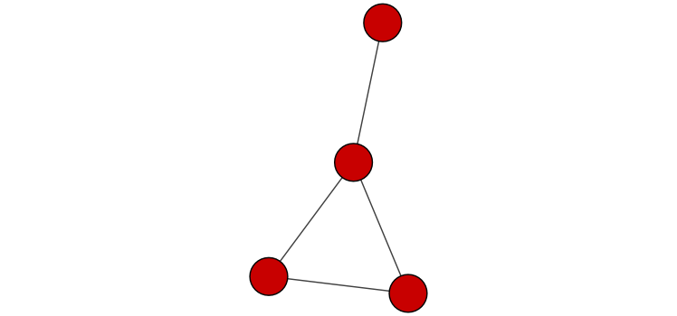
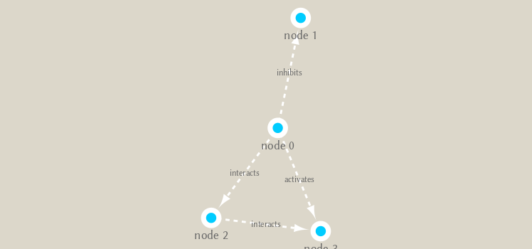
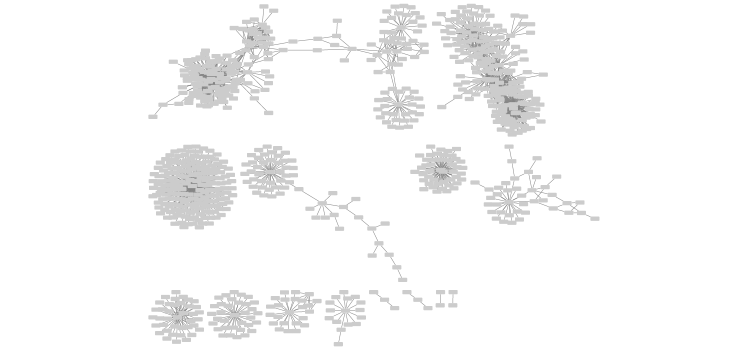

```{r setup, include=FALSE}
knitr::opts_chunk$set(echo = TRUE)
```

## Set up Cytoscape and R connection

Load the required packages **RCy3** from bioconductor and **igraph** from CRAN.

```{r}
library(RCy3)
library(igraph)
```

Check connection to Cytoscape...

```{r}
cytoscapePing()
```


## Make a simple graph
```{r}
g <- makeSimpleIgraph()
createNetworkFromIgraph(g,"myGraph")
```

Include the graph in this report.

```{r}
fig <- exportImage(filename="demo", type="png", height=350)

```

Change the visual style...

```{r}
setVisualStyle("Marquee")
fig <- exportImage(filename="demo_marquee", type="png", height=350)


```


## Actual metagenomics data

Read the data....
```{r}
prok_vir_cor <- read.delim("./data/virus_prok_cor_abundant.tsv", stringsAsFactors = FALSE)

## Have a peak at the first 6 rows
head(prok_vir_cor)
```


Create the graph
```{r}
g <- graph.data.frame(prok_vir_cor, directed = F)
class(g)
g
```


Plot it
```{r}
plot(g, vertex.label = NA)
```


Make the nodes smaller
```{r}
plot(g, vertex.label = NA, vertex.size = 3)
```


## Network queries

```{r}
V(g)
E(g)
```


Calculate some graph theory measures...

```{r}
cb <- cluster_edge_betweenness(g)
```

```{r}
plot(cb, y = g, vertex.label = NA, vertex.size = 3)
```


Extract membership information
```{r}
head(membership(cb))
```


## Node degree
```{r}
# Calculate and plot node degree of our network
d <- degree(g)
hist(d, breaks=30, col="lightblue", main ="Node Degree Distribution")
plot( degree_distribution(g), type="h" )
plot(degree_distribution(g), log = 'xy')
```

## Centrality Analaysis
Answer this question: Which nodes are the most important and why???

First method: PageRank

```{r}
pr <- page_rank(g)
head(pr$vector)
```


Plot graph with nodes scaled by page rank score

```{r}
# Make a size vector btwn 2 and 20 for node plotting size

v.size <- BBmisc::normalize(pr$vector, range=c(2,20), method="range")
plot(g, vertex.size=v.size, vertex.label=NA)
```

Second method: node degree
```{r}
v.size <- BBmisc::normalize(d, range=c(2,20), method="range")
plot(g, vertex.size=v.size, vertex.label=NA)
```

Third method: betweenness

```{r}
b <- betweenness(g)
v.size <- BBmisc::normalize(b, range=c(2,20), method="range")
plot(g, vertex.size=v.size, vertex.label=NA)
```


## Read taxonomic classification for network annotation

```{r}
phage_id_affiliation <- read.delim("./data/phage_ids_with_affiliation.tsv")
head(phage_id_affiliation)

bac_id_affi <- read.delim("./data/prok_tax_from_silva.tsv", stringsAsFactors = FALSE)
head(bac_id_affi)
```


```{r}
## Extract out our vertex names
genenet.nodes <- as.data.frame(vertex.attributes(g), stringsAsFactors=FALSE)
head(genenet.nodes)
```

How many phage entries do we have?

```{r}
sum(grepl('ph_', genenet.nodes$name))
```

Merge annotation data with phylogenetic data...

```{r}
# We dont need all annotation data so lets make a reduced table 'z' for merging
z <- bac_id_affi[,c("Accession_ID", "Kingdom", "Phylum", "Class")]
n <- merge(genenet.nodes, z, by.x="name", by.y="Accession_ID", all.x=TRUE)
head(n)

# Again we only need a subset of `phage_id_affiliation` for our purposes
y <- phage_id_affiliation[, c("first_sheet.Phage_id_network", "phage_affiliation","Tax_order", "Tax_subfamily")]

# Add the little phage annotation that we have
x <- merge(x=n, y=y, by.x="name", by.y="first_sheet.Phage_id_network", all.x=TRUE)

## Remove duplicates from multiple matches
x <- x[!duplicated( (x$name) ),]
head(x)
```

Save the annotation data to the graph nodes..

```{r}
genenet.nodes <- x
```

## Send network to Cytoscape using RCy3
```{r}
# delete any existing networks
deleteAllNetworks()
```


```{r}
# Set the main nodes colname to the required "id" 
colnames(genenet.nodes)[1] <- "id"
```

Add the network data to edges/nodes and send to cytoscape

```{r}
genenet.edges <- data.frame(igraph::as_edgelist(g))

# Set the main edges colname to the required "source" and "target" 
colnames(genenet.edges) <- c("source","target")

# Add the weight from igraph to a new column...
genenet.edges$Weight <- igraph::edge_attr(g)$weight

# Send as a new network to Cytoscape
createNetworkFromDataFrames(genenet.nodes,genenet.edges, 
                            title="Tara_Oceans")
```


Save a figure of the cytoscape network here...

```{r}
fig <- exportImage(filename="tara_oceans", type="png", height=350)


```