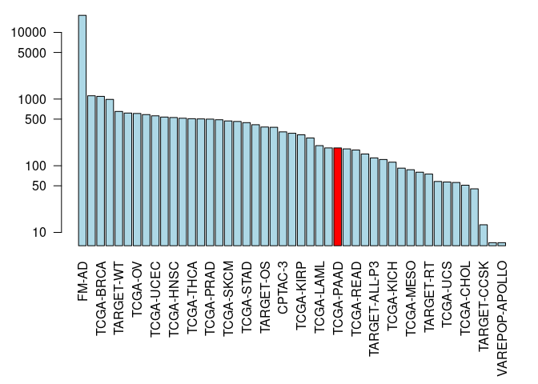

Class 18: Cancer genomics
================
Akshara Balachandra
5/31/2019

Load the libraries

``` r
require(GenomicDataCommons)
```

    ## Loading required package: GenomicDataCommons

    ## Loading required package: magrittr

    ## 
    ## Attaching package: 'GenomicDataCommons'

    ## The following object is masked from 'package:stats':
    ## 
    ##     filter

``` r
require(TCGAbiolinks)
```

    ## Loading required package: TCGAbiolinks

    ## Registered S3 methods overwritten by 'ggplot2':
    ##   method         from 
    ##   [.quosures     rlang
    ##   c.quosures     rlang
    ##   print.quosures rlang

    ## Registered S3 method overwritten by 'R.oo':
    ##   method        from       
    ##   throw.default R.methodsS3

``` r
require(maftools)
```

    ## Loading required package: maftools

``` r
require(dplyr)
```

    ## Loading required package: dplyr

    ## 
    ## Attaching package: 'dplyr'

    ## The following object is masked from 'package:Biobase':
    ## 
    ##     combine

    ## The following objects are masked from 'package:BiocGenerics':
    ## 
    ##     combine, intersect, setdiff, union

    ## The following objects are masked from 'package:GenomicDataCommons':
    ## 
    ##     count, filter, select

    ## The following objects are masked from 'package:stats':
    ## 
    ##     filter, lag

    ## The following objects are masked from 'package:base':
    ## 
    ##     intersect, setdiff, setequal, union

``` r
status()
```

    ## $commit
    ## [1] "3e22a4257d5079ae9f7193950b51ed9dfc561ed1"
    ## 
    ## $data_release
    ## [1] "Data Release 17.0 - June 05, 2019"
    ## 
    ## $status
    ## [1] "OK"
    ## 
    ## $tag
    ## [1] "1.21.0"
    ## 
    ## $version
    ## [1] 1

# Section 1

## Querying GDC from R

``` r
projects <- getGDCprojects()
head(projects)
```

    ##   dbgap_accession_number
    ## 1              phs001287
    ## 2              phs001374
    ## 3              phs001628
    ## 4              phs000466
    ## 5              phs000467
    ## 6              phs001179
    ##                                                                                                                                                                                                                                                                                                                                                                                                                                                                                                                                                                                                                                 disease_type
    ## 1                                                                                                                                                                                                                                                                                                                                                                                                                                                                                                                                                                                                               Adenomas and Adenocarcinomas
    ## 2                                                                                                                                                                                                                                                                                                                                                                                                                                                                                                                                                                                         Epithelial Neoplasms, NOS, Squamous Cell Neoplasms
    ## 3                                                                                                                                                                                                                                                                                                                                                                                                                                                                                                                                                                                                                          Myeloid Leukemias
    ## 4                                                                                                                                                                                                                                                                                                                                                                                                                                                                                                                                                                                                           Clear Cell Sarcoma of the Kidney
    ## 5                                                                                                                                                                                                                                                                                                                                                                                                                                                                                                                                                                                                                              Neuroblastoma
    ## 6 Germ Cell Neoplasms, Acinar Cell Neoplasms, Miscellaneous Tumors, Thymic Epithelial Neoplasms, Gliomas, Basal Cell Neoplasms, Neuroepitheliomatous Neoplasms, Ductal and Lobular Neoplasms, Complex Mixed and Stromal Neoplasms, Complex Epithelial Neoplasms, Adnexal and Skin Appendage Neoplasms, Mesothelial Neoplasms, Mucoepidermoid Neoplasms, Not Reported, Specialized Gonadal Neoplasms, Cystic, Mucinous and Serous Neoplasms, Adenomas and Adenocarcinomas, Epithelial Neoplasms, NOS, Squamous Cell Neoplasms, Transitional Cell Papillomas and Carcinomas, Paragangliomas and Glomus Tumors, Nevi and Melanomas, Meningiomas
    ##   releasable released state
    ## 1      FALSE     TRUE  open
    ## 2      FALSE     TRUE  open
    ## 3      FALSE     TRUE  open
    ## 4       TRUE     TRUE  open
    ## 5       TRUE     TRUE  open
    ## 6      FALSE     TRUE  open
    ##                                                                                                                                                                                                                                                                                                                                                                                                                                                                                                                                                                                                                                                                                                                                                                                                                                                               primary_site
    ## 1                                                                                                                                                                                                                                                                                                                                                                                                                                                                                                                                                                                                                                                                                                                                                                                                                                   Kidney, Bronchus and lung, Uterus, NOS
    ## 2                                                                                                                                                                                                                                                                                                                                                                                                                                                                                                                                                                                                                                                                                                                                                                                                                                                        Bronchus and lung
    ## 3                                                                                                                                                                                                                                                                                                                                                                                                                                                                                                                                                                                                                                                                                                                                                                                                                            Hematopoietic and reticuloendothelial systems
    ## 4                                                                                                                                                                                                                                                                                                                                                                                                                                                                                                                                                                                                                                                                                                                                                                                                                                                                   Kidney
    ## 5                                                                                                                                                                                                                                                                                                                                                                                                                                                                                                                                                                                                                                                                                                                                                                                                                                                           Nervous System
    ## 6 Testis, Gallbladder, Unknown, Other and unspecified parts of biliary tract, Adrenal gland, Thyroid gland, Spinal cord, cranial nerves, and other parts of central nervous system, Peripheral nerves and autonomic nervous system, Stomach, Cervix uteri, Bladder, Small intestine, Breast, Prostate gland, Other and unspecified female genital organs, Other and unspecified major salivary glands, Rectum, Retroperitoneum and peritoneum, Pancreas, Heart, mediastinum, and pleura, Bronchus and lung, Liver and intrahepatic bile ducts, Other and ill-defined sites, Thymus, Penis, Nasopharynx, Ovary, Uterus, NOS, Vulva, Anus and anal canal, Other and unspecified urinary organs, Trachea, Ureter, Other endocrine glands and related structures, Not Reported, Colon, Kidney, Vagina, Skin, Esophagus, Eye and adnexa, Other and ill-defined digestive organs
    ##              project_id                    id
    ## 1               CPTAC-3               CPTAC-3
    ## 2        VAREPOP-APOLLO        VAREPOP-APOLLO
    ## 3 BEATAML1.0-CRENOLANIB BEATAML1.0-CRENOLANIB
    ## 4           TARGET-CCSK           TARGET-CCSK
    ## 5            TARGET-NBL            TARGET-NBL
    ## 6                 FM-AD                 FM-AD
    ##                                                                                              name
    ## 1                                                                                                
    ## 2                                                          VA Research Precision Oncology Program
    ## 3 Clinical Resistance to Crenolanib in Acute Myeloid Leukemia Due to Diverse Molecular Mechanisms
    ## 4                                                                Clear Cell Sarcoma of the Kidney
    ## 5                                                                                   Neuroblastoma
    ## 6                                       Foundation Medicine Adult Cancer Clinical Dataset (FM-AD)
    ##        tumor
    ## 1          3
    ## 2     APOLLO
    ## 3 CRENOLANIB
    ## 4       CCSK
    ## 5        NBL
    ## 6         AD

Find number of cases per project

``` r
cases.by.proj <- cases() %>% facet('project.project_id') %>%
  aggregations()
head(cases.by.proj$project.project_id)
```

    ##          key doc_count
    ## 1      FM-AD     18004
    ## 2 TARGET-NBL      1120
    ## 3  TCGA-BRCA      1098
    ## 4 TARGET-AML       988
    ## 5  TARGET-WT       652
    ## 6   TCGA-GBM       617

Plot the number of cases by project

``` r
colvec <- rep('lightblue', nrow(cases.by.proj$project.project_id))
colvec[cases.by.proj$project.project_id$key == 'TCGA-PAAD'] <- 'red'


par(mar = c(9, 4, 1, 1))
barplot(cases.by.proj$project.project_id$doc_count, 
        names.arg = cases.by.proj$project.project_id$key,
        log = 'y',
        las = 2,
        col = colvec)
```

<!-- -->

Exploratory analyses.

``` r
samp <- getSampleFilesSummary('TCGA-PAAD')
```

    ## Accessing information for project: TCGA-PAAD

    ## Using 'state_comment' as value column. Use 'value.var' to override

    ## Aggregation function missing: defaulting to length

``` r
head(samp)
```

    ##            .id Biospecimen_Biospecimen Supplement
    ## 1 TCGA-2J-AAB1                                 14
    ## 2 TCGA-2J-AAB4                                 14
    ## 3 TCGA-2J-AAB6                                 14
    ## 4 TCGA-2J-AAB8                                 14
    ## 5 TCGA-2J-AAB9                                 14
    ## 6 TCGA-2J-AABA                                 14
    ##   Biospecimen_Slide Image_Diagnostic Slide
    ## 1                                        1
    ## 2                                        1
    ## 3                                        1
    ## 4                                        1
    ## 5                                        1
    ## 6                                        1
    ##   Biospecimen_Slide Image_Tissue Slide Clinical_Clinical Supplement
    ## 1                                    1                            8
    ## 2                                    1                            8
    ## 3                                    1                            8
    ## 4                                    1                            8
    ## 5                                    1                            8
    ## 6                                    1                            8
    ##   Copy Number Variation_Copy Number Segment_Genotyping Array_Affymetrix SNP 6.0
    ## 1                                                                             2
    ## 2                                                                             2
    ## 3                                                                             2
    ## 4                                                                             2
    ## 5                                                                             2
    ## 6                                                                             2
    ##   Copy Number Variation_Gene Level Copy Number Scores_Genotyping Array_Affymetrix SNP 6.0
    ## 1                                                                                       1
    ## 2                                                                                       1
    ## 3                                                                                       1
    ## 4                                                                                       1
    ## 5                                                                                       1
    ## 6                                                                                       1
    ##   Copy Number Variation_Masked Copy Number Segment_Genotyping Array_Affymetrix SNP 6.0
    ## 1                                                                                    2
    ## 2                                                                                    2
    ## 3                                                                                    2
    ## 4                                                                                    2
    ## 5                                                                                    2
    ## 6                                                                                    2
    ##   DNA Methylation_Methylation Beta Value_Methylation Array_Illumina Human Methylation 450
    ## 1                                                                                       1
    ## 2                                                                                       1
    ## 3                                                                                       1
    ## 4                                                                                       1
    ## 5                                                                                       1
    ## 6                                                                                       1
    ##   Sequencing Reads_Aligned Reads_miRNA-Seq_Illumina
    ## 1                                                 1
    ## 2                                                 1
    ## 3                                                 1
    ## 4                                                 1
    ## 5                                                 1
    ## 6                                                 1
    ##   Sequencing Reads_Aligned Reads_RNA-Seq_Illumina
    ## 1                                               1
    ## 2                                               1
    ## 3                                               1
    ## 4                                               1
    ## 5                                               1
    ## 6                                               1
    ##   Sequencing Reads_Aligned Reads_WXS_Illumina
    ## 1                                           2
    ## 2                                           2
    ## 3                                           2
    ## 4                                           2
    ## 5                                           2
    ## 6                                           2
    ##   Simple Nucleotide Variation_Aggregated Somatic Mutation_WXS
    ## 1                                                           4
    ## 2                                                           4
    ## 3                                                           4
    ## 4                                                           4
    ## 5                                                           4
    ## 6                                                           4
    ##   Simple Nucleotide Variation_Annotated Somatic Mutation_WXS
    ## 1                                                          4
    ## 2                                                          4
    ## 3                                                          4
    ## 4                                                          4
    ## 5                                                          4
    ## 6                                                          4
    ##   Simple Nucleotide Variation_Masked Somatic Mutation_WXS
    ## 1                                                       4
    ## 2                                                       4
    ## 3                                                       4
    ## 4                                                       4
    ## 5                                                       4
    ## 6                                                       4
    ##   Simple Nucleotide Variation_Raw Simple Somatic Mutation_WXS
    ## 1                                                           4
    ## 2                                                           4
    ## 3                                                           4
    ## 4                                                           4
    ## 5                                                           4
    ## 6                                                           4
    ##   Transcriptome Profiling_Gene Expression Quantification_RNA-Seq
    ## 1                                                              3
    ## 2                                                              3
    ## 3                                                              3
    ## 4                                                              3
    ## 5                                                              3
    ## 6                                                              3
    ##   Transcriptome Profiling_Isoform Expression Quantification_miRNA-Seq
    ## 1                                                                   1
    ## 2                                                                   1
    ## 3                                                                   1
    ## 4                                                                   1
    ## 5                                                                   1
    ## 6                                                                   1
    ##   Transcriptome Profiling_miRNA Expression Quantification_miRNA-Seq
    ## 1                                                                 1
    ## 2                                                                 1
    ## 3                                                                 1
    ## 4                                                                 1
    ## 5                                                                 1
    ## 6                                                                 1
    ##     project
    ## 1 TCGA-PAAD
    ## 2 TCGA-PAAD
    ## 3 TCGA-PAAD
    ## 4 TCGA-PAAD
    ## 5 TCGA-PAAD
    ## 6 TCGA-PAAD

``` r
query <- GDCquery(project = 'TCGA-PAAD',
                  data.category = 'Transcriptome Profiling',
                  data.type = 'Gene Expression Quantification')
```

    ## --------------------------------------

    ## o GDCquery: Searching in GDC database

    ## --------------------------------------

    ## Genome of reference: hg38

    ## --------------------------------------------

    ## oo Accessing GDC. This might take a while...

    ## --------------------------------------------

    ## ooo Project: TCGA-PAAD

    ## --------------------

    ## oo Filtering results

    ## --------------------

    ## ooo By data.type

    ## ----------------

    ## oo Checking data

    ## ----------------

    ## ooo Check if there are duplicated cases

    ## Warning: There are more than one file for the same case. Please verify query results. You can use the command View(getResults(query)) in rstudio

    ## ooo Check if there results for the query

    ## -------------------

    ## o Preparing output

    ## -------------------

``` r
ans <- getResults(query)

head(ans)
```

    ##   data_release                      data_type
    ## 1  12.0 - 17.0 Gene Expression Quantification
    ## 2  12.0 - 17.0 Gene Expression Quantification
    ## 3  12.0 - 17.0 Gene Expression Quantification
    ## 4  12.0 - 17.0 Gene Expression Quantification
    ## 5  12.0 - 17.0 Gene Expression Quantification
    ## 6  12.0 - 17.0 Gene Expression Quantification
    ##                   updated_datetime
    ## 1 2019-05-23T23:18:56.468363+00:00
    ## 2 2019-05-23T23:18:56.468363+00:00
    ## 3 2019-05-23T23:18:56.468363+00:00
    ## 4 2019-05-23T23:18:56.468363+00:00
    ## 5 2019-05-23T23:18:56.468363+00:00
    ## 6 2019-05-23T23:18:56.468363+00:00
    ##                                              file_name
    ## 1  4df16e07-cdbc-46cc-8b9c-39d4a9dca09e.FPKM-UQ.txt.gz
    ## 2 1f997074-0020-47e6-9928-5bf7209c552d.htseq.counts.gz
    ## 3 cc133a8a-77ad-4570-852e-df72548c6897.htseq.counts.gz
    ## 4  e7cc80ef-4b87-47d9-bebe-1fb05b5b04a2.FPKM-UQ.txt.gz
    ## 5 232f085b-6201-4e4d-8473-e592b8d8e16d.htseq.counts.gz
    ## 6     a155ec07-2baf-404b-85bc-28330a8fee33.FPKM.txt.gz
    ##                                  submitter_id
    ## 1 4df16e07-cdbc-46cc-8b9c-39d4a9dca09e_uqfpkm
    ## 2  1f997074-0020-47e6-9928-5bf7209c552d_count
    ## 3  cc133a8a-77ad-4570-852e-df72548c6897_count
    ## 4 e7cc80ef-4b87-47d9-bebe-1fb05b5b04a2_uqfpkm
    ## 5  232f085b-6201-4e4d-8473-e592b8d8e16d_count
    ## 6   a155ec07-2baf-404b-85bc-28330a8fee33_fpkm
    ##                                file_id file_size
    ## 1 4ac5c2da-497f-4fb4-80db-c7e774c1873a    526515
    ## 2 78bb8d49-54aa-43a1-aec4-31da818cdb14    250443
    ## 3 82d7d3b5-85bc-46b9-b9cd-2bdeb279dc0f    255221
    ## 4 3cbf3948-3ac4-4824-9b6f-6efcf13066b5    556107
    ## 5 13dfd8da-5d36-48fa-a82c-77b5c5e77e7b    252815
    ## 6 c6a9b770-845a-4a10-ac02-28928def043c    504140
    ##                          cases                                   id
    ## 1 TCGA-YY-A8LH-01A-11R-A36G-07 4ac5c2da-497f-4fb4-80db-c7e774c1873a
    ## 2 TCGA-H6-A45N-01A-11R-A26U-07 78bb8d49-54aa-43a1-aec4-31da818cdb14
    ## 3 TCGA-RB-AA9M-01A-11R-A39D-07 82d7d3b5-85bc-46b9-b9cd-2bdeb279dc0f
    ## 4 TCGA-HZ-8637-01A-11R-2404-07 3cbf3948-3ac4-4824-9b6f-6efcf13066b5
    ## 5 TCGA-HZ-7918-01A-11R-2156-07 13dfd8da-5d36-48fa-a82c-77b5c5e77e7b
    ## 6 TCGA-2J-AABP-01A-11R-A41B-07 c6a9b770-845a-4a10-ac02-28928def043c
    ##                   created_datetime                           md5sum
    ## 1 2016-05-30T18:58:14.322399-05:00 fece0a61ad30a786de8ee50d25028d61
    ## 2 2016-05-30T18:21:31.785829-05:00 31eaf2ddc469f44cbbcddf92e631af67
    ## 3 2016-05-30T18:32:49.244208-05:00 435a535f7904090d6b97eb2eee7ed71e
    ## 4 2016-05-29T10:21:16.740924-05:00 9d250e9709c04a2005a93948fc8e11eb
    ## 5 2016-05-29T10:37:43.483990-05:00 fb22772a5d5948778ea2f77cdecb3050
    ## 6 2016-05-30T18:36:35.355486-05:00 7dd83ad6f57154e1ce9c921f2d61d7a3
    ##   data_format access    state version           data_category
    ## 1         TXT   open released       1 Transcriptome Profiling
    ## 2         TXT   open released       1 Transcriptome Profiling
    ## 3         TXT   open released       1 Transcriptome Profiling
    ## 4         TXT   open released       1 Transcriptome Profiling
    ## 5         TXT   open released       1 Transcriptome Profiling
    ## 6         TXT   open released       1 Transcriptome Profiling
    ##              type experimental_strategy   project
    ## 1 gene_expression               RNA-Seq TCGA-PAAD
    ## 2 gene_expression               RNA-Seq TCGA-PAAD
    ## 3 gene_expression               RNA-Seq TCGA-PAAD
    ## 4 gene_expression               RNA-Seq TCGA-PAAD
    ## 5 gene_expression               RNA-Seq TCGA-PAAD
    ## 6 gene_expression               RNA-Seq TCGA-PAAD
    ##                            analysis_id        analysis_updated_datetime
    ## 1 509f861f-23f1-4201-b0ea-90cfd03ccd49 2018-09-10T15:08:41.786316-05:00
    ## 2 e196345c-9a5d-481d-abd1-67c65c271283 2018-09-10T15:08:41.786316-05:00
    ## 3 7d970bb5-b3d5-4e90-9a32-cfddb0590287 2018-09-10T15:08:41.786316-05:00
    ## 4 f6899766-4888-436e-bc07-3158e2fbf0a9 2018-09-10T15:08:41.786316-05:00
    ## 5 3283f6cf-5aff-4833-b7a8-60726c06d7f6 2018-09-10T15:08:41.786316-05:00
    ## 6 21eda9da-73c8-44c2-a666-c7ca7a570a23 2018-09-10T15:08:41.786316-05:00
    ##          analysis_created_datetime
    ## 1 2016-05-30T18:58:14.322399-05:00
    ## 2 2016-05-30T18:21:31.785829-05:00
    ## 3 2016-05-30T18:32:49.244208-05:00
    ## 4 2016-05-29T10:21:16.740924-05:00
    ## 5 2016-05-29T10:37:43.483990-05:00
    ## 6 2016-05-30T18:36:35.355486-05:00
    ##                         analysis_submitter_id analysis_state
    ## 1 4df16e07-cdbc-46cc-8b9c-39d4a9dca09e_uqfpkm       released
    ## 2  1f997074-0020-47e6-9928-5bf7209c552d_count       released
    ## 3  cc133a8a-77ad-4570-852e-df72548c6897_count       released
    ## 4 e7cc80ef-4b87-47d9-bebe-1fb05b5b04a2_uqfpkm       released
    ## 5  232f085b-6201-4e4d-8473-e592b8d8e16d_count       released
    ## 6   a155ec07-2baf-404b-85bc-28330a8fee33_fpkm       released
    ##                 analysis_workflow_link analysis_workflow_type
    ## 1 https://github.com/NCI-GDC/htseq-cwl        HTSeq - FPKM-UQ
    ## 2 https://github.com/NCI-GDC/htseq-cwl         HTSeq - Counts
    ## 3 https://github.com/NCI-GDC/htseq-cwl         HTSeq - Counts
    ## 4 https://github.com/NCI-GDC/htseq-cwl        HTSeq - FPKM-UQ
    ## 5 https://github.com/NCI-GDC/htseq-cwl         HTSeq - Counts
    ## 6 https://github.com/NCI-GDC/htseq-cwl           HTSeq - FPKM
    ##   analysis_workflow_version   tissue.definition
    ## 1                        v1 Primary solid Tumor
    ## 2                        v1 Primary solid Tumor
    ## 3                        v1 Primary solid Tumor
    ## 4                        v1 Primary solid Tumor
    ## 5                        v1 Primary solid Tumor
    ## 6                        v1 Primary solid Tumor

``` r
nrow(ans)
```

    ## [1] 546

## Section 2

Read in fasta sequence

``` r
require(bio3d)
```

    ## Loading required package: bio3d

``` r
seqs <- read.fasta('./data/lecture18_sequences.fa')
#head(seqs)
```

Q1: Identify sequence regions that contain all 9-mer peptides that are
only found in the tumor.

Align the sequences and do it.

``` r
aln <- seqaln(seqs, exefile = 'muscle', outfile = 'cancer_aln.fasta')

align <- aln$ali[,which(aln$ali[2,] != '-')] # filter out parts of seq where it doesn't exist

inds <- which(apply(align, 2, function(x) {length(unique(x)) != 1}))

#align[,inds]

nine.mers <- lapply(inds, function(x) {
  if(x < 8) {
    return(aln$ali[2,0:(x+8)])
  }
  return(aln$ali[2,(x - 8):(x+8)])
})

nine.mers
```

    ## [[1]]
    ##  [1] "S" "P" "L" "P" "S" "Q" "A" "M" "L" "D" "L" "M" "L" "S" "P" "D" "D"
    ## 
    ## [[2]]
    ##  [1] "D" "P" "G" "P" "D" "E" "A" "P" "W" "M" "P" "E" "A" "A" "P" "P" "V"
    ## 
    ## [[3]]
    ##  [1] "Y" "L" "D" "D" "R" "N" "T" "F" "V" "H" "S" "V" "V" "V" "P" "Y" "E"
    ## 
    ## [[4]]
    ##  [1] "I" "L" "T" "I" "I" "T" "L" "E" "V" "-" "-" "-" "-" "-" "-" "-" "-"

``` r
max_length <- length(nine.mers[[1]])
list_lists <- sapply (nine.mers, function (x) {length (x) <- max_length; return (x)})

t(list_lists)
```

    ##      [,1] [,2] [,3] [,4] [,5] [,6] [,7] [,8] [,9] [,10] [,11] [,12] [,13]
    ## [1,] "S"  "P"  "L"  "P"  "S"  "Q"  "A"  "M"  "L"  "D"   "L"   "M"   "L"  
    ## [2,] "D"  "P"  "G"  "P"  "D"  "E"  "A"  "P"  "W"  "M"   "P"   "E"   "A"  
    ## [3,] "Y"  "L"  "D"  "D"  "R"  "N"  "T"  "F"  "V"  "H"   "S"   "V"   "V"  
    ## [4,] "I"  "L"  "T"  "I"  "I"  "T"  "L"  "E"  "V"  "-"   "-"   "-"   "-"  
    ##      [,14] [,15] [,16] [,17]
    ## [1,] "S"   "P"   "D"   "D"  
    ## [2,] "A"   "P"   "P"   "V"  
    ## [3,] "V"   "P"   "Y"   "E"  
    ## [4,] "-"   "-"   "-"   "-"

``` r
write.fasta(seqs = t(list_lists), ids = c(1:4), file = 'nine-mers.fasta')
```
