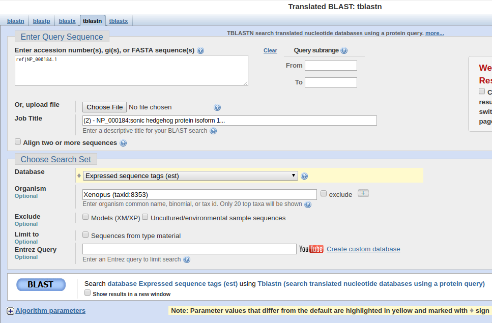
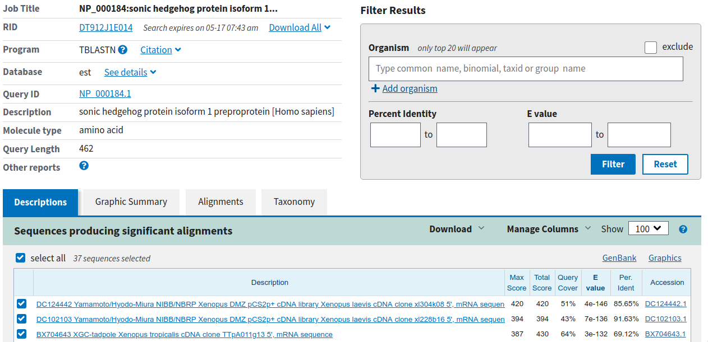
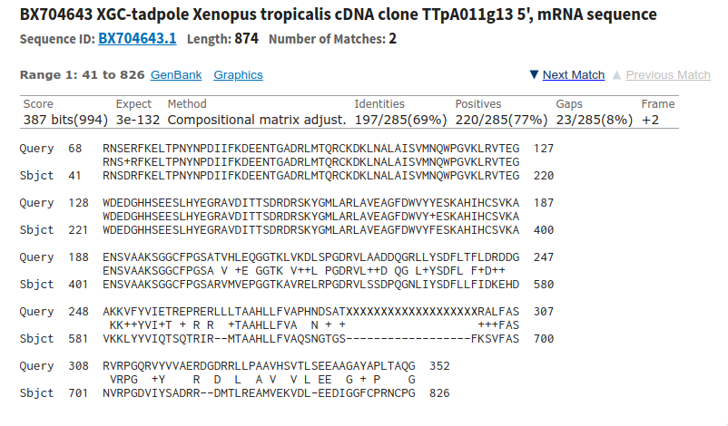
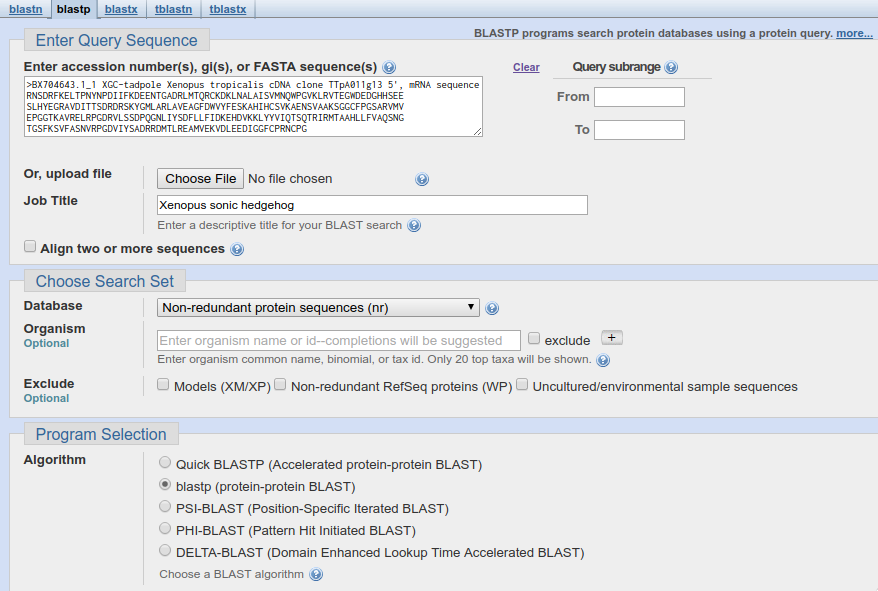
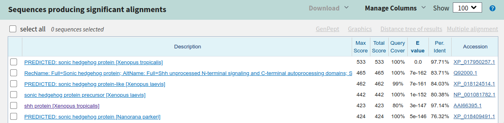
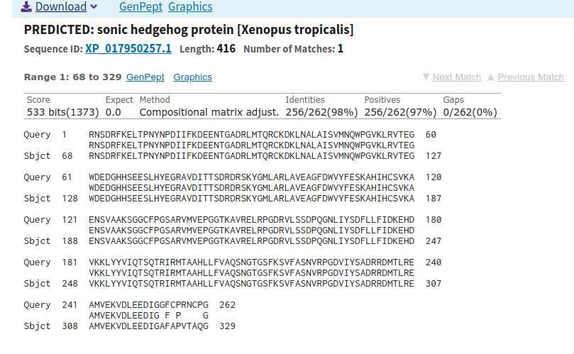
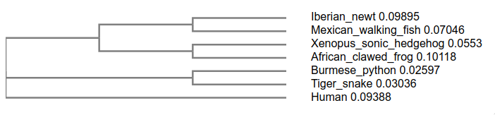
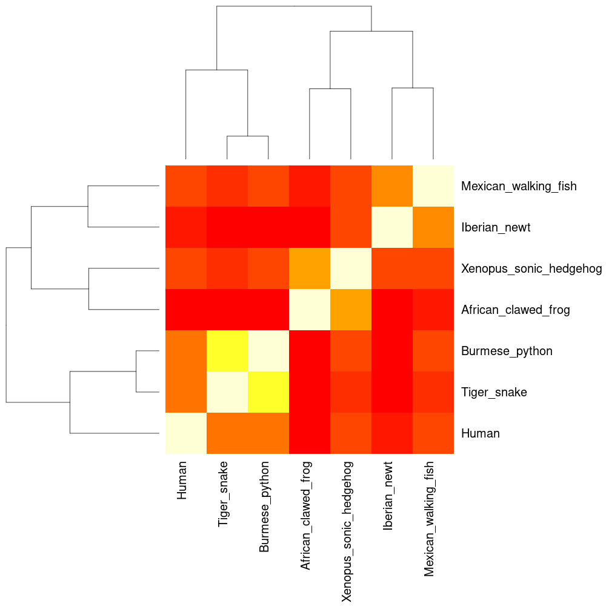

# Question 1: Name of the protein

**Name**: Sonic Hedgehog protein isoform 1 preprotein (SHH)

**Accession**: NP_000184.1

**Species**: Homo sapiens

**Function**: Critical role in development of the nervous system, lungs, teeth, and may
also have regenerative functions.

# Question 2: BLAST search

**Method**: TBLASTN search against Xenopus ESTs

**Database**: Expressed sequence tags (est)

**Organism**: Xenopus (Taxid: 8353)

## Alignment details

**Chosen match:** Accession BX704643.1, a 874bp clone from Xenopus *tropicalis*.

```
>BX704643.1 BX704643 XGC-tadpole Xenopus tropicalis cDNA
clone TTpA011g13 5', mRNA sequence

cDNA clone TTpA011g13, mRNA sequence.
Length: 874

Score           Expect   Method                         Identities
387 bits(994)   3e-132   Compositional matrix adjust.   197/285(69%)

Positives      Gaps         Frame
220/285(77%)   23/285(8%)   +2


Query  68   RNSERFKELTPNYNPDIIFKDEENTGADRLMTQRCKDKLNALAISVMNQWPGVKLRVTEG  127
            RNS+RFKELTPNYNPDIIFKDEENTGADRLMTQRCKDKLNALAISVMNQWPGVKLRVTEG
Sbjct  41   RNSDRFKELTPNYNPDIIFKDEENTGADRLMTQRCKDKLNALAISVMNQWPGVKLRVTEG  220

Query  128  WDEDGHHSEESLHYEGRAVDITTSDRDRSKYGMLARLAVEAGFDWVYYESKAHIHCSVKA  187
            WDEDGHHSEESLHYEGRAVDITTSDRDRSKYGMLARLAVEAGFDWVY+ESKAHIHCSVKA
Sbjct  221  WDEDGHHSEESLHYEGRAVDITTSDRDRSKYGMLARLAVEAGFDWVYFESKAHIHCSVKA  400

Query  188  ENSVAAKSGGCFPGSATVHLEQGGTKLVKDLSPGDRVLAADDQGRLLYSDFLTFLDRDDG  247
            ENSVAAKSGGCFPGSA V +E GGTK V++L PGDRVL++D QG L+YSDFL F+D++
Sbjct  401  ENSVAAKSGGCFPGSARVMVEPGGTKAVRELRPGDRVLSSDPQGNLIYSDFLLFIDKEHD  580

Query  248  AKKVFYVIETREPRERLLLTAAHLLFVAPHNDSATXXXXXXXXXXXXXXXXXXXRALFAS  307
            KK++YVI+T + R R  +TAAHLLFVA  N + +                   +++FAS
Sbjct  581  VKKLYYVIQTSQTRIR--MTAAHLLFVAQSNGTGS------------------FKSVFAS  700

Query  308  RVRPGQRVYVVAERDGDRRLLPAAVHSVTLSEEAAGAYAPLTAQG  352
            VRPG  +Y    R  D  L  A V  V L EE  G + P    G
Sbjct  701  NVRPGDVIYSADRR--DMTLREAMVEKVDL-EEDIGGFCPRNCPG  826
```

{ width=5in }

{ width=5in }

{ width=4.5in }

\pagebreak

# Question 3: Novel Protein Information

**Chosen Sequence:**
```
>Xenopus tropicalis protein (from BLAST result)
RNSDRFKELTPNYNPDIIFKDEENTGADRLMTQRCKDKLNALAISVMNQWPGVKLRVTEG
WDEDGHHSEESLHYEGRAVDITTSDRDRSKYGMLARLAVEAGFDWVYFESKAHIHCSVKA
ENSVAAKSGGCFPGSARVMVEPGGTKAVRELRPGDRVLSSDPQGNLIYSDFLLFIDKEHD
VKKLYYVIQTSQTRIRMTAAHLLFVAQSNGTGSFKSVFASNVRPGDVIYSADRRDMTLRE
AMVEKVDLEEDIGGFCPRNCPG
```

**Name:** *Xenopus* sonic hedgehog

**Species:** Xenopus (Silurana) tropicalis (Common name: western clawed frog, Taxid: 8364)

Eukaryota; Metazoa; Chordata; Craniata; Vertebrata; Euteleostomi;
Amphibia; Batrachia; Anura; Pipoidea; Pipidae; Xenopodinae; Xenopus; Silurana

# Question 4: Proof that gene/protein are novel

A BLASTP search against the NR database yielded a top hit to a protein from
*Xenopus tropicalis* with 100% coverage and 97.71% identity. The alignment
details are given in the screenshots below.

{width=6in}

{width=6in}

{width=6in}

\pagebreak
# Question 5: Multiple sequence alignment

## Relabeled sequences for alignment
```
>Xenopus_sonic_hedgehog (from BLAST result)
RNSDRFKELTPNYNPDIIFKDEENTGADRLMTQRCKDKLNALAISVMNQWPGVKLRVTEG
WDEDGHHSEESLHYEGRAVDITTSDRDRSKYGMLARLAVEAGFDWVYFESKAHIHCSVKA
ENSVAAKSGGCFPGSARVMVEPGGTKAVRELRPGDRVLSSDPQGNLIYSDFLLFIDKEHD
VKKLYYVIQTSQTRIRMTAAHLLFVAQSNGTGSFKSVFASNVRPGDVIYSADRRDMTLRE
AMVEKVDLEEDIGGFCPRNCPG

>Human |Sonic hedgehog protein (NP_000184.1) [Homo sapiens]
MLLLARCLLLVLVSSLLVCSGLACGPGRGFGKRRHPKKLTPLAYKQFIPNVAEKTLGASGRYEGKISRNS
ERFKELTPNYNPDIIFKDEENTGADRLMTQRCKDKLNALAISVMNQWPGVKLRVTEGWDEDGHHSEESLH
YEGRAVDITTSDRDRSKYGMLARLAVEAGFDWVYYESKAHIHCSVKAENSVAAKSGGCFPGSATVHLEQG
GTKLVKDLSPGDRVLAADDQGRLLYSDFLTFLDRDDGAKKVFYVIETREPRERLLLTAAHLLFVAPHNDS
ATGEPEASSGSGPPSGGALGPRALFASRVRPGQRVYVVAERDGDRRLLPAAVHSVTLSEEAAGAYAPLTA
QGTILINRVLASCYAVIEEHSWAHRAFAPFRLAHALLAALAPARTDRGGDSGGGDRGGGGGRVALTAPGA
ADAPGAGATAGIHWYSQLLYQIGTWLLDSEALHPLGMAVKSS

>Mexican_walking_fish |sonic hedgehog [Ambystoma mexicanum] ARX70249.1
MGEMRLLLRRLLLGTLVWALLVPSGLTCGPGRGIGKRRQPKKLTPLAYKQFIPNVAEKTLGASGRYEGKI
TRNSDRFKELTPNYNPDIIFKDEENTGADRLMTQRCKDKLNALAISVMNQWPGVKLRVTEGWDEDGHHSE
ESLHYEGRAVDITTSDRDRSKYGMLARLAVEAGFDWVYFESKAHIHCSVKAENSVAAKSGGCFPASAKVT
LEHGVTRPVKDLRPGDRVLAADGQGRLVYS DFLMFLDKEEAVTKVFYVIETERPRQRLRLTAAHLLFAA
RHPANSSSSTGFQSIFASRVRPGHRVLTVDQEGRGLQEATVTRVYLEEGAGAYAPVTSHGTVVIDKVLAS
CYAVIEEHSWAHWAFAPLRLGYGILSIFSPQDYSPHSPPAPSQKEGVHWYSEILYHIGTWVLHSDTIHPW
GMAAKSS

>Iberian_newt |sonic hedgehog-related protein [Pleurodeles waltl]
MGEMILLRRDLLGGFISTLLVPLGLGCGPGRGIGQRRRPQKLTPLAYKQFIPNVSEKTLGASGRYEVKITRNSERFQELT
PNYNPDIIFKVEENTGADRLMTQRCKDKLNSLAISVMNQWPGVKLRVTEGWDEDGHHSEESLHYEGRAVDITTSDRDRSK
YGMLARLAVEAGFDWVYFESKAHIHCSVKAENSVAVKSGGCFPGSATVTLEQGVRIPVKGLKPGNRVLAVDVEGRLIYSD
FLLFMDEEETARKVFYVIETSLPRERLRLTAAHLLFVAQEHPGNASAGNFRSKFGHRRFRSMFASSVRPGHRVLTEDREG
RGLREATVDRVYLEEATGAYAPVTAHGTVVIDRVLASCYAVIEEHSWAHWAFAPLRVGFGILSFFSPQDYSSHSPPAPSQ
AEGVHWYSEILYRIGTWVLQADTIHPLGMAAKSS

>African_clawed_frog |sonic hedgehog protein-like|XP_018124514.1 [Xenopus laevis]
MSVATGILLLGFTCSLLIPPGLSCGPGRGIGKRRHPKKLTPLVYKQFIPNVAEKTLGASGRYEGKIASNSDRFKELTPNY
NPDIVFKDEENTGADRLMTQRCKDKLNALAISVMNQWPGVKLRVTEGWDEDGHHLEESLHYEGRAVDITTSDRDRSKYGM
LARLAVEAGFDWVYYESKAHIHCSVKAENSVAAKSGGCFPAGAEVMVELGGTKAVKDLRPGDRVLSSDAQGNLLYSDFLL
FIDQQHDVKKLFYVIETSHPRRRIRLTAAHLLFVAQVNGSRSFKSVFASSIQPGDIIYSADPRAMALNEVKVEKVGLEED
TGAYAPLTAHGTLVIDQVLSSCYALIEEHTWAHLAFAPLRFGLSLSPYLFPKDSSPSPQSHHQLDSSPSPQSHHQPEGIH
WYSQLLYQLGTWLLDSNSLHPLGMATKSS

>Burmese_python |sonic hedgehog protein|XP_007433256.1 [Python bivittatus]
MLLRRRSGLLPLCLGALFLSAGLACGPGRGFGKRRHPKKLTPLAYKQFIPNVAEKTLGASGRYEGKISRNSERFKELTPN
YNPDIIFKDEENTGADRLMTQRCKDKLNALAISVMNQWPGVKLRVTEGWDEDGHHSEESLHYEGRAVDITTSDRDRSKYG
MLARLAVEAGFDWVYYESKAHIHCSVKAENSVAAKSGGCFPGSAWVNLEEGGTKLVKDLRPGDRVLAADVHGQLFYSEFL
AFLDREDPPVHKLFYVIETQRPQTRLLLTAAHLLFVAPPQNHSHSQPQPIFASRVQPGQQVYVLGQGGQTLLQAAVHSVS
LQEEASGAYAPLTAQGTILINQVLASCYAVIEEHSWAHWAFAPFRMAHAVLAMLDPEGLSSPLLFPAAAPEESSSLAGVH
WYSRLLYHIGRWILDSETMHPLGMAS

>Tiger_snake |sonic hedgehog protein |XP_026536709.1 [Notechis scutatus]
MLLLRRTGLLPLCLGALFLSAGLACGPGRGFGKRRHPKKLTPLAYKQFIPNVAEKTLGASGRYEGKITRNSERFKELTPN
YNPDIIFKDEENTGADRLMTQRCKDKLNALAISVMNQWPGVKLRVTEGWDEDGHHSEESLHYEGRAVDITTSDRDRSKYG
MLARLAVEAGFDWVYYESKAHIHCSVKAENSVAAKSGGCFPGSAWVNLEGGGTKLVKDLHPGDRVLAADVHGQLFYSEFL
AFLDREEPPVHKLFYVIETQTPQARLLLTAAHLLFVAPPHNHSHSQPQPIFASRVQPGQHVYVLAQGGQTLLPAAVHSVS
LKEEASGAYAPLTAQGTILINQVLASCYAVIEEHSWAHWAFAPFRIAHAALAVLNLEGLSSPLLFPAAVPEEGASLAGVH
WYSRLLYYIGRWILGSEMMHPLGMAS
```

## Alignment
Using local MUSCLE (v3.8) program with bio3d `seqaln()`. The fasta output
was converted to CLUSTALW format using `seaview`.

```
CLUSTAL multiple sequence alignment by MUSCLE (3.8)

Iberian_newt            -MGEMILLRRDLLGGF-ISTLLVPLGLGCGPGRGIGQRRRPQKLTPLAYKQFIPNVSEKT
Mexican_walking_fish    MGEMRLLLRRLLLGTL-VWALLVPSGLTCGPGRGIGKRRQPKKLTPLAYKQFIPNVAEKT
African_clawed_frog     ----MSVATGILLLGF-TCSLLIPPGLSCGPGRGIGKRRHPKKLTPLVYKQFIPNVAEKT
Xenopus_sonic_hedgehog  ------------------------------------------------------------
Burmese_python          ----MLLRRRSGLLPLCLGALFLSAGLACGPGRGFGKRRHPKKLTPLAYKQFIPNVAEKT
Tiger_snake             ----MLLLRRTGLLPLCLGALFLSAGLACGPGRGFGKRRHPKKLTPLAYKQFIPNVAEKT
Human                   ----MLLLARCLLLVL-VSSLLVCSGLACGPGRGFGKRRHPKKLTPLAYKQFIPNVAEKT

Iberian_newt            LGASGRYEVKITRNSERFQELTPNYNPDIIFKVEENTGADRLMTQRCKDKLNSLAISVMN
Mexican_walking_fish    LGASGRYEGKITRNSDRFKELTPNYNPDIIFKDEENTGADRLMTQRCKDKLNALAISVMN
African_clawed_frog     LGASGRYEGKIASNSDRFKELTPNYNPDIVFKDEENTGADRLMTQRCKDKLNALAISVMN
Xenopus_sonic_hedgehog  ------------RNSDRFKELTPNYNPDIIFKDEENTGADRLMTQRCKDKLNALAISVMN
Burmese_python          LGASGRYEGKISRNSERFKELTPNYNPDIIFKDEENTGADRLMTQRCKDKLNALAISVMN
Tiger_snake             LGASGRYEGKITRNSERFKELTPNYNPDIIFKDEENTGADRLMTQRCKDKLNALAISVMN
Human                   LGASGRYEGKISRNSERFKELTPNYNPDIIFKDEENTGADRLMTQRCKDKLNALAISVMN


Iberian_newt            QWPGVKLRVTEGWDEDGHHSEESLHYEGRAVDITTSDRDRSKYGMLARLAVEAGFDWVYF
Mexican_walking_fish    QWPGVKLRVTEGWDEDGHHSEESLHYEGRAVDITTSDRDRSKYGMLARLAVEAGFDWVYF
African_clawed_frog     QWPGVKLRVTEGWDEDGHHLEESLHYEGRAVDITTSDRDRSKYGMLARLAVEAGFDWVYY
Xenopus_sonic_hedgehog  QWPGVKLRVTEGWDEDGHHSEESLHYEGRAVDITTSDRDRSKYGMLARLAVEAGFDWVYF
Burmese_python          QWPGVKLRVTEGWDEDGHHSEESLHYEGRAVDITTSDRDRSKYGMLARLAVEAGFDWVYY
Tiger_snake             QWPGVKLRVTEGWDEDGHHSEESLHYEGRAVDITTSDRDRSKYGMLARLAVEAGFDWVYY
Human                   QWPGVKLRVTEGWDEDGHHSEESLHYEGRAVDITTSDRDRSKYGMLARLAVEAGFDWVYY


Iberian_newt            ESKAHIHCSVKAENSVAVKSGGCFPGSATVTLEQGVRIPVKGLKPGNRVLAVDVEGRLIY
Mexican_walking_fish    ESKAHIHCSVKAENSVAAKSGGCFPASAKVTLEHGVTRPVKDLRPGDRVLAADGQGRLVY
African_clawed_frog     ESKAHIHCSVKAENSVAAKSGGCFPAGAEVMVELGGTKAVKDLRPGDRVLSSDAQGNLLY
Xenopus_sonic_hedgehog  ESKAHIHCSVKAENSVAAKSGGCFPGSARVMVEPGGTKAVRELRPGDRVLSSDPQGNLIY
Burmese_python          ESKAHIHCSVKAENSVAAKSGGCFPGSAWVNLEEGGTKLVKDLRPGDRVLAADVHGQLFY
Tiger_snake             ESKAHIHCSVKAENSVAAKSGGCFPGSAWVNLEGGGTKLVKDLHPGDRVLAADVHGQLFY
Human                   ESKAHIHCSVKAENSVAAKSGGCFPGSATVHLEQGGTKLVKDLSPGDRVLAADDQGRLLY


Iberian_newt            SDFLLFMDEEE-TARKVFYVIETSLPRERLRLTAAHLLFVAQEHPGNASAGNFRSKFGHR
Mexican_walking_fish    SDFLMFLDKEE-AVTKVFYVIETERPRQRLRLTAAHLLFAAR-HPANSSSST--------
African_clawed_frog     SDFLLFIDQQH-DVKKLFYVIETSHPRRRIRLTAAHLLFVAQ----VNGSRS--------
Xenopus_sonic_hedgehog  SDFLLFIDKEH-DVKKLYYVIQTS--QTRIRMTAAHLLFVAQ----SNGTGS--------
Burmese_python          SEFLAFLDREDPPVHKLFYVIETQRPQTRLLLTAAHLLFVAP--PQNHSHSQ--------
Tiger_snake             SEFLAFLDREEPPVHKLFYVIETQTPQARLLLTAAHLLFVAP--PHNHSHSQ--------
Human                   SDFLTFLDRDD-GAKKVFYVIETREPRERLLLTAAHLLFVAP--HNDSATGEPEASSGSG


Iberian_newt            -------RFRSMFASSVRPGHRVLTEDR--EGRGLREATVDRVYL-EEATGAYAPVTAHG
Mexican_walking_fish    -------GFQSIFASRVRPGHRVLTVDQ--EGRGLQEATVTRVYL-EEGAGAYAPVTSHG
African_clawed_frog     --------FKSVFASSIQPGDIIYSADP--RAMALNEVKVEKVGL-EEDTGAYAPLTAHG
Xenopus_sonic_hedgehog  --------FKSVFASNVRPGDVIYSADR--RDMTLREAMVEKVDL-EEDIGGFCPRNCPG
Burmese_python          --------PQPIFASRVQPGQQVYVLGQ--GGQTLLQAAVHSVSLQEEASGAYAPLTAQG
Tiger_snake             --------PQPIFASRVQPGQHVYVLAQ--GGQTLLPAAVHSVSLKEEASGAYAPLTAQG
Human                   PPSGGALGPRALFASRVRPGQRVYVVAERDGDRRLLPAAVHSVTLSEEAAGAYAPLTAQG


Iberian_newt            TVVIDRVLASCYAVIEEHSWAHWAFAPLRVGFGILSFFSPQ-------------------
Mexican_walking_fish    TVVIDKVLASCYAVIEEHSWAHWAFAPLRLGYGILSIFSPQ-------------------
African_clawed_frog     TLVIDQVLSSCYALIEEHTWAHLAFAPLRFGLSLSPYLFPK-----------DSSPSPQS
Xenopus_sonic_hedgehog  ------------------------------------------------------------
Burmese_python          TILINQVLASCYAVIEEHSWAHWAFAPFRMAHAVLAMLDPE----------------GLS
Tiger_snake             TILINQVLASCYAVIEEHSWAHWAFAPFRIAHAALAVLNLE----------------GLS
Human                   TILINRVLASCYAVIEEHSWAHRAFAPFRLAHALLAALAPARTDRGGDSGGGDRGGGGGR


Iberian_newt            ---DYSSHSPPAPS-QAEGVHWYSEILYRIGTWVLQADTIHPLGMAAKSS
Mexican_walking_fish    ---DYSPHSPPAPS-QKEGVHWYSEILYHIGTWVLHSDTIHPWGMAAKSS
African_clawed_frog     HHQLDSSPSPQSHH-QPEGIHWYSQLLYQLGTWLLDSNSLHPLGMATKSS
Xenopus_sonic_hedgehog  --------------------------------------------------
Burmese_python          SPLLFPAAAPEESS-SLAGVHWYSRLLYHIGRWILDSETMHPLGMAS---
Tiger_snake             SPLLFPAAVPEEGA-SLAGVHWYSRLLYYIGRWILGSEMMHPLGMAS---
Human                   VALTAPGAADAPGAGATAGIHWYSQLLYQIGTWLLDSEALHPLGMAVKSS
```

# Question 6: Phylogenetic tree
I used the simple phylogeny tool from EBI with the following parameters:

- Tree format: `nj`
- Distance correction: `False`
- Excludes Gaps: `False`
- Clustering Methods: `Neighbor-joining`
- Percent identity matrix: `False`

The resulting tree is this.

{ width=5in }

# Question 7: Heatmap of aligned sequences

{ width=4in }

# Question 8: Protein Database Search
Consensus sequence:

```
>Consensus Sequence 50% threshold
----MLLLRR-LLL-L----LL---GL-CGPGRG-GKRRHPKKLTPLAYKQFIPNVAEKT
LGASGRYEGKI-RNSERFKELTPNYNPDIIFKDEENTGADRLMTQRCKDKLNALAISVMN
QWPGVKLRVTEGWDEDGHHSEESLHYEGRAVDITTSDRDRSKYGMLARLAVEAGFDWVYY
ESKAHIHCSVKAENSVAAKSGGCFPGSA-V-LE-GGTK-VKDLRPGDRVLAAD-QG-L-Y
SDFL-FLD-E---V-KLFYVIET--PR-RLRLTAAHLLFVA---P-N-S-----------
--------F-S-FASRVRPG--VY--D----G--L-EA-V--V-L-EEA-GAYAPLTA-G
T--I--VLASCYAVIEEHSWAHWAFAP-R-----L--L-P--------------------
---------P--------GVHWYS-LLY-IGTW-L-S---HPLGMA-KSS
```


\begin{table}[h]
\caption{Similar atomic resolution structures from PDB to the consensus sequence
generated from alignments requiring at least 50\% sequence identity threshold.}
\label{tab:my-table}
\begin{tabular}{@{}lllllll@{}}
\toprule
ID   & Name                    & Technique           & Resolution & Source       & Evalue    & Identity \\ \midrule
6DMY & Sonic Hedgehog protein  & Electron microscopy & 3.6        & Homo sapiens & 3.98e-124 & 98.286   \\
1VHH & SONIC HEDGEHOG          & X-ray diffraction   & 1.7        & Mus musculus & 1.79e-116 & 99.383   \\
3K7G & Indian Hedgehog protein & X-ray diffraction   & 1.5        & Homo sapiens & 7.96e-113 & 88.136   \\ \bottomrule
\end{tabular}
\end{table}

# Question 9: Molecular figure

{ width=5in }

The Indian Hedgehog protein is very likely to have similar structural motifs as and functions to Xenopus sonic hedgehog,
since this protein has 88.14% identity to the consensus sequence. Sequence similarity above 80% is considered very
similar.

# Question 10: CHEMBL Assays

Performing a CHEMBL search for the Xenopus SHH sequence from Question 3 gave me hits to two SHH genes from
different species, Mus *musculus* (CHEMBL5387) and Homo *sapiens* (CHEMBL5602). For the top hit (CHEMBL5387),
there are 26 binding assays and 23 Functional assays. There are also 125 ligand efficiency assays.

The study referenced below involved a small molecule that binds Shh in human cells, robotnikinin. Robotnikinin
significantly inhibits Shh activity and presents as a "valuable...probe of dieases associated with aberrant Shh-pathway
activity."

Stanton, B.Z., Peng, L.F., Maloof, N., Nakai, K., Wang, X., Duffner, J.L., Taveras, K.M., Hyman, J.M.,
Lee, S.W., Koehler, A.N. and Chen, J.K., 2009. A small molecule that binds Hedgehog and blocks its signaling
in human cells. *Nature chemical biology*, 5(3), p.154.
